## Genome assembly
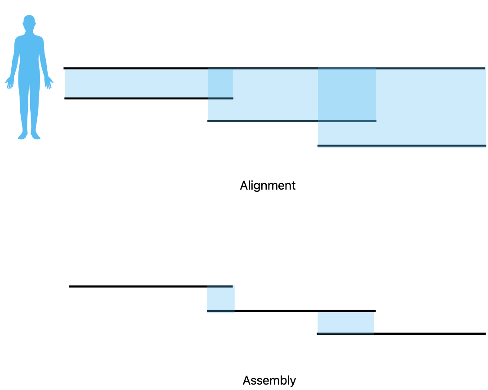 <!-- .element height="80%" width="80%" -->

<small>Acknowledgement: Some slides borrowed with permission from Dr. Ben Langmead, JHU</small>

Note: Genome assembly is the process of reconstructing a genome sequence from a large collection of short, overlapping DNA reads. It is one of the foundational problems in computational biology — every genome project, from bacteria to humans, requires it. The core challenge is that we cannot read a genome end to end; instead we read millions of fragments and must reconstruct the original from the pieces. This lecture covers the statistical foundations of sequencing coverage and the two dominant algorithmic strategies: Overlap-Layout-Consensus for long reads, and De Bruijn graphs for short reads.

---

## Shotgun sequencing and genome assembly
<iframe width="659" height="371" src="https://www.youtube.com/embed/pfgnrOOwqSU" title="YouTube video player" frameborder="0" allow="accelerometer; autoplay; clipboard-write; encrypted-media; gyroscope; picture-in-picture" allowfullscreen></iframe>

<a href="https://www.youtube.com/embed/pfgnrOOwqSU" class="small">HHMI</a>

Note: Shotgun sequencing requires multiple copies of the genome, which are effectively blown up into millions of small fragments. Each fragment is then sequenced. The small fragments are assembled using an immense amount of computer power to match overlapping sections. The drawback of this method comes when dealing with repeat sequences. Often there is no way of knowing how long the repeat sequence is, or in which of the many different possible positions the fragments overlap. Even the incredibly powerful software used to shotgun sequence the human genome couldn't cope with this. So Celera, the private company which relied on this approach, had to use the public data to fill in the gaps left by the repeats.

---

## Outline

1. Shotgun sequencing and coverage
2. Sequencing technologies
3. Overlap Layout Consensus
4. De Bruijn graphs
5. From contigs to scaffolds
6. Evaluating assemblies

Note: This lecture covers the two dominant algorithmic approaches to genome assembly. The first half motivates the problem and develops the statistical foundations of sequencing coverage. The second half covers the two main algorithmic strategies — OLC for long reads and De Bruijn graphs for short reads — followed by the post-assembly steps of scaffolding and quality assessment.

---

## Shotgun sequencing
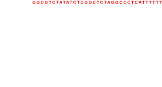

Note: The key idea of shotgun sequencing: we cannot sequence a whole genome in one piece. Instead, we break many copies of the genome into random fragments and sequence each fragment independently. The challenge is then reassembling these fragments into the original genome — like putting together a jigsaw puzzle without knowing what the picture looks like.

---

## Shotgun sequencing
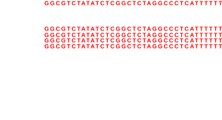

Note: Each fragment is sequenced to produce a "read." Modern sequencers produce millions to billions of reads per run. The reads overlap because the fragmentation is random — different copies of the genome are cut at different positions, so adjacent regions are covered by different reads.

---

## Shotgun sequencing
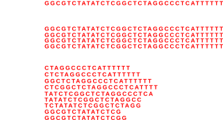

Note: Because fragmentation is random and we sequence many copies, most positions in the genome will be covered by multiple reads. This redundancy is called coverage or depth. Coverage is critical — positions with zero reads form gaps, and positions with very low coverage are unreliable. Higher coverage means better assembly, up to a point.

---

## Genome assembly
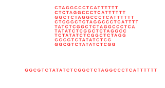

Note: The assembly problem: given millions of short reads, reconstruct the original genome sequence. The reads are an unordered, redundant, error-prone sample from the genome. We need to find overlaps between reads and stitch them into longer sequences called contigs, and eventually into scaffolds spanning whole chromosomes.

---

## Genome assembly
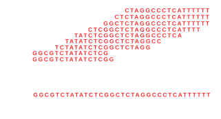

Note: Reads that overlap are joined into contigs — contiguous sequences with no internal gaps. Contigs are then ordered and oriented using paired-end information to form scaffolds. Gaps between contigs within a scaffold are filled with Ns. The goal is to produce as few, as long, and as accurate contigs/scaffolds as possible.

---

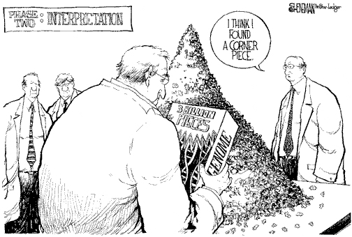

<small>Human Genome cartoons, Slate magazine, US</small>

Note: A humorous take on the complexity of genome assembly. Assembling the human genome was one of the most computationally challenging problems of the early 2000s. The first human genome assembly took years of work from hundreds of scientists and cost ~$3 billion. Today, a high-quality human genome assembly can be done for a few thousand dollars in days — and the first truly gapless human genome was only completed in 2022 by the Telomere-to-Telomere (T2T) consortium.

---

## Coverage
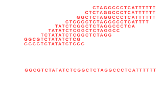

Note: Coverage (depth) measures how many reads cover each position of the genome. A position covered by 30 reads has 30x coverage. Higher coverage reduces the chance of gaps and helps distinguish sequencing errors (which appear at low frequency) from true variants (which appear consistently). The challenge: coverage is not perfectly uniform — GC-rich regions are over-represented in Illumina sequencing, and repetitive regions are ambiguous.

---

## Gaps
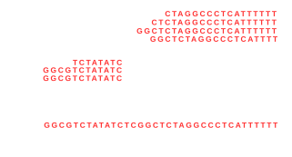

Note: Gaps occur where no read spans a region — either because of insufficient coverage or because the region is difficult to sequence (e.g., highly repetitive sequences, extreme GC content, secondary structures). Gaps are represented as runs of Ns in the assembly. Some gaps were never closed for decades — centromeres and telomeres remained incomplete in the human reference genome until the T2T assembly in 2022.

---

## How much sequencing do we need?

* How many reads $N$ do we need to sequence the genome?
* Too few: gaps remain; too many: expensive and computationally slow
* We need a mathematical model of coverage

Note: Before we can assemble, we need to answer a practical question: how much sequencing is enough? This motivates a statistical model of read coverage. The answer depends on genome size, read length, and how much coverage we need at each position. This is the Lander-Waterman model, developed for the original Human Genome Project.

---

## Statistics

* Parameters
  * $G$ = genome length in nucleotides
  * $L$ = read length in nucleotides
  * $N$ = number of reads sequenced
* Coverage $a$ = ?

Note: Introduce the three fundamental parameters. Ask students to think about what coverage should mean intuitively — how many times, on average, does each nucleotide get read? Then ask them to derive the formula before revealing it on the next slide.

---

## Statistics

* Parameters
  * $G$ = genome length in nucleotides
  * $L$ = read length in nucleotides
  * $N$ = number of reads sequenced
* Coverage $a$ = $\frac{NL}{G}$

Note: Coverage = total bases sequenced divided by genome size. NL is the total number of nucleotides sequenced (N reads, each of length L). Dividing by G gives the average number of times each position is covered. Example: human genome G=3×10^9 bp, read length L=150 bp, 600M reads → coverage = 600M × 150 / 3×10^9 = 30x. A typical WGS experiment targets 30x coverage.

---

## Statistics

* Assume reads are distributed uniformly through the genome.
* The probability that one of the $N$ reads starts at any specific nucleotide is $N/G$.

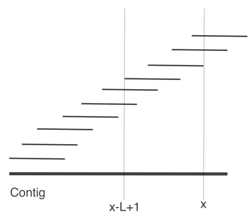

Note: This is the key simplifying assumption: reads start at uniformly random positions. In reality, coverage is not perfectly uniform — GC-rich regions are over-represented in Illumina sequencing, repetitive regions are ambiguous, etc. But uniform coverage is a useful first-order model. The probability that a specific read starts at a specific nucleotide is 1/G (there are G possible starting positions), so the probability that at least one of N reads starts there is approximately N/G for large G.

---

## Statistics

* The probability that one of the $N$ reads starts at any specific nucleotide is $N/G$.
* Expected # of reads starting in interval $I$ of length $L$ is $\frac{NL}{G} = a$

Note: An interval of length L has L possible starting positions. Each has probability N/G of being a read start. So the expected number of read starts in the interval is (N/G)*L = NL/G = a, the coverage. This connects the coverage formula to the probability model. The interval I of length L corresponds to the window of positions from which a read would need to start in order to cover a given nucleotide.

---

## Poisson distribution

* A discrete probability distribution that expresses the probability of a given number of events occurring in a fixed interval of time if these events occur with a known constant mean rate and independently of the time since the last event.
* With expectation of $\lambda$ events in a given interval, the probability of $k$ events in the same interval is $$\frac{\lambda^ke^{-\lambda}}{k!}$$

Note: The Poisson distribution is appropriate here because: (1) reads arrive independently (each fragment is sequenced independently), (2) the rate is constant under the uniform coverage assumption, (3) events are discrete (integer number of reads). It approximates the binomial distribution well when N is large and p=N/G is small — exactly our situation. The mean λ equals the coverage a.

---

## Statistics

* The probability that one of the $N$ reads starts at any specific nucleotide is $N/G$.
* Expected # of reads starting in interval $I$ of length $L$ is $\frac{NL}{G} = a$
* We can assume a Poisson distribution
    * $\lambda$ events in a given interval
    * probability of k events = ${\frac {\lambda ^{k}e^{-\lambda }}{k!}}$

* $p$ = $P$(no read starts in $I$) = $e^{-a}$
* $q$ = $P$(at least one read starts in $I$) = $1 - e^{-a}$

Note: In the equation, we set k=0 and λ=a. The other option is a binomial distribution where p=(1 - N/G)^L, but Poisson is more accurate in the case where it is likely that multiple reads start at the same position. Setting k=0: P(0 reads in interval) = e^(-a). This is the probability of a gap at a given position.

---

## Statistics

How much of the genome was sequenced?

* Position $x$ is in a gap if no read starts in $[x − L + 1, x]$
* We showed this has probability $p = e^{−a}$
* Estimates
  * Nucleotides in gaps = $pG$ = $e^{-a}G$
  * Nucleotides in contigs = $qG$ = $(1 - e^{-a})G$
* To have 99% genome in contigs and 1% in gaps:
  * $p = e^{−a} = 0.01$
  * $a \approx 4.6$
  * So, sequence 13.8 billion nucleotides, and you will still miss 30 million positions in the genome

Note: This is the Lander-Waterman model (1988). The key insight: even at high coverage, some positions will be missed due to random chance — gaps never completely disappear, they just become exponentially rare. To halve the gap fraction, you need to increase coverage by ln(2) ≈ 0.69. The 13.8 billion bp figure assumes a 3 Gb human genome: 4.6 × 3×10^9 = 13.8×10^9 bases sequenced, yet 1% of 3×10^9 = 30 million positions remain in gaps.

---

## $a \approx 4.6$ is an underestimate

The model assumes:
* Reads start at **uniformly random** positions — violated in practice
* All covered positions can be **assembled** — violated by repeats
* Reads are **error-free** — violated by sequencing technology

Real consequences:
* **GC bias**: Illumina under-sequences AT-rich and GC-extreme regions 
* **Repeats**: a repeated region may be well-covered but still unassemblable 
* **Sequencing errors**: erroneous reads contribute coverage but cannot be assembled correctly

In practice, confident assemblies require significantly more coverage than the model predicts — the exact amount depends on the assembler, technology, and genome complexity.

Note: This is a critical slide — the model gives students intuition but they should not take the number literally. Ask them: if GC bias causes some regions to get 0x coverage no matter how much you sequence, what does that imply for the model? It means p=e^(-a) underestimates the true gap probability. For Illumina, regions with >70% or <30% GC are systematically under-represented. Repeats are equally important: a region covered by 30 reads is useless for assembly if all 30 reads map equally well to 100 different locations in the genome. The required coverage varies significantly by assembler, technology, and genome — the model's prediction should be treated as a theoretical lower bound, not a practical target.

---

## More is better?
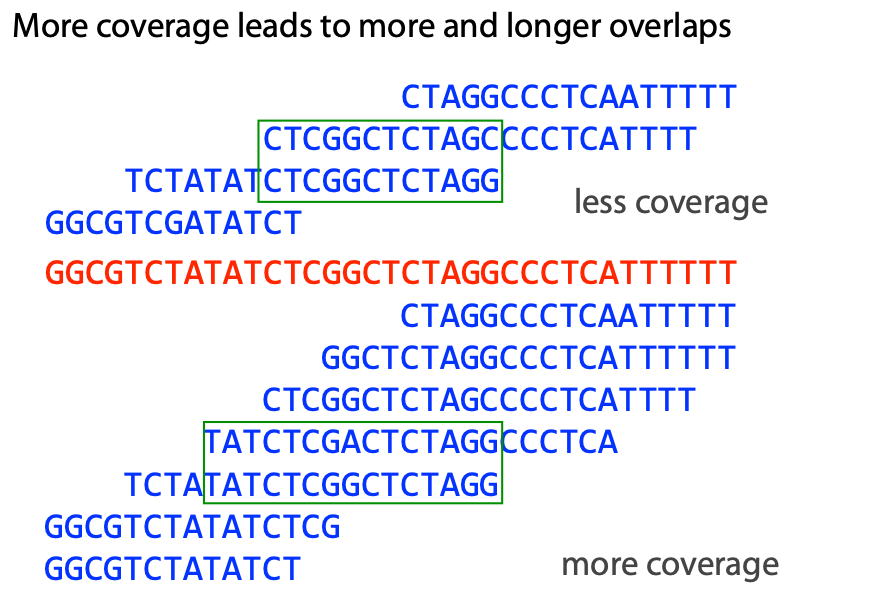 <!-- .element width="70%" height="70%" -->

Note: If we assume that sequencing of reads is random, then as more reads are sequenced, more start points for the reads and hence larger overlaps are reasonable. But there are diminishing returns — doubling coverage does not double assembly quality. Beyond a certain point, errors from the sequencer and complexity from repeats dominate, and more coverage helps less. There is also a computational cost: more reads means more memory and time to assemble.

---

## Sequencing technologies

| | Illumina | PacBio HiFi | Oxford Nanopore |
|---|---|---|---|
| **Read length** | ~150 bp | ~15–20 kb | ~10–100 kb |
| **Error rate** | ~0.1% | ~0.1% | ~1–5% |
| **Throughput** | Very high | High | High |
| **Cost per Gb** | Low | Medium | Medium |
| **Strengths** | Accuracy, scale | Long + accurate | Longest reads |

Note: The choice of sequencing technology directly determines which assembly algorithm to use. Illumina's short but accurate reads suit De Bruijn graph assemblers — there are too many reads for pairwise overlap detection. PacBio HiFi produces long, accurate reads ideal for OLC assemblers that can span repeats. Nanopore produces the longest reads but with higher error rates, requiring error correction. The field is shifting toward long-read assembly: the T2T human genome used PacBio HiFi and Nanopore reads.

---

## Why read length matters

* Most repeats in the human genome are **shorter than 10 kb**
  * SINEs (e.g., Alu): ~300 bp
  * LINEs (e.g., L1): ~6 kb
  * Segmental duplications: up to ~500 kb
* A read that **spans** a repeat uniquely places itself in the assembly
* Short reads (~150 bp) cannot span most repeats → graph tangles
* Long reads (~15 kb) span most repeats → unambiguous placement

Note: This is the fundamental reason for the long-read revolution in genome assembly. Alu elements are ~300 bp — a 15 kb PacBio read spans them easily. L1 elements are ~6 kb — still spanned by most long reads. Segmental duplications are the hardest challenge: at up to 500 kb, even long reads cannot span them, requiring Hi-C or other long-range information. The fraction of the genome that is "repeat-unresolvable" decreases as read lengths increase.

---

## Pairwise overlaps
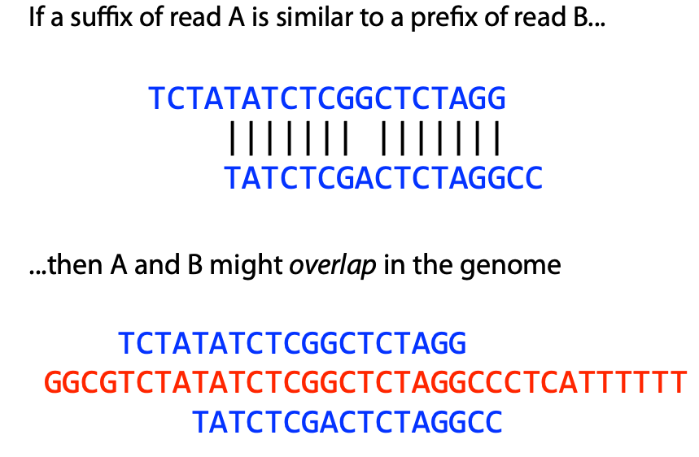 <!-- .element width="70%" height="70%" -->

Note: Even in this case, why could there be differences between overlapping reads? 1. Sequencing errors — reads are not perfect copies of the genome. 2. Ploidy — humans have 2 copies of each chromosome, and those copies differ at heterozygous positions. Real assemblers have to account for ploidy, but we are going to ignore it to simplify issues in this lecture. Detecting overlaps between all pairs of reads is the foundation of the OLC approach.

---

## Two approaches to assembly
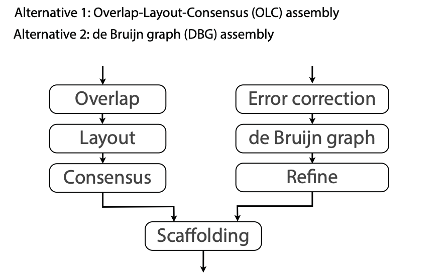 <!-- .element width="70%" height="70%" -->

Note: Two fundamentally different algorithmic strategies for assembly. Overlap-Layout-Consensus (OLC) was the dominant approach for long reads (Sanger sequencing era). De Bruijn graph approaches dominate for short-read (NGS) assembly. The choice depends primarily on read length — OLC builds a graph of reads connected by overlaps; De Bruijn builds a graph of k-mers. Both must find a path through the graph that represents the original genome.

---

## Overlap Layout Consensus
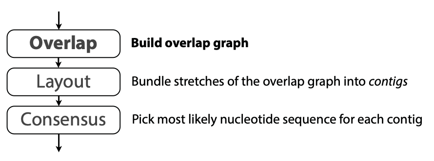 <!-- .element width="70%" height="70%" -->

Note: Examples of such assemblers include SGA, Fermi, Celera, and Canu (for long reads). The three phases: (1) Overlap — find all pairwise overlaps between reads. This is O(N^2) for N reads, which is expensive. (2) Layout — build the overlap graph, simplify it, and find a path visiting each read once. (3) Consensus — for each position in the layout, determine the most likely nucleotide from all reads covering that position.

---

## Overlap
Overlap : Suffix of a read is similar to the prefix of another read

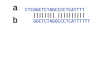 <!-- .element width="50%" height="50%" -->

Note: An overlap between two reads means the end (suffix) of one read is similar — not necessarily identical, due to sequencing errors — to the beginning (prefix) of another. The overlap has a length and a number of mismatches. We set a minimum overlap length threshold to avoid spurious overlaps that arise by chance.

---

## Overlap
Overlap : Suffix of a read is similar to the prefix of another read

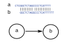 <!-- .element width="50%" height="50%" -->

Note: We can represent such an overlap with a directed graph, where directed edges connect overlapping nodes (reads). The suffix of the source is similar to the prefix of the sink. Effectively, we want to do this for all pairs of reads to build our overlap graph. With N reads, there are O(N^2) pairs to check — for millions of reads this is very expensive. BLAST-like hashing tricks are used to make this feasible in practice.

---

## Overlap graph
Overlap graph can contain cycles. A cycle is a path beginning and ending at the same vertex.

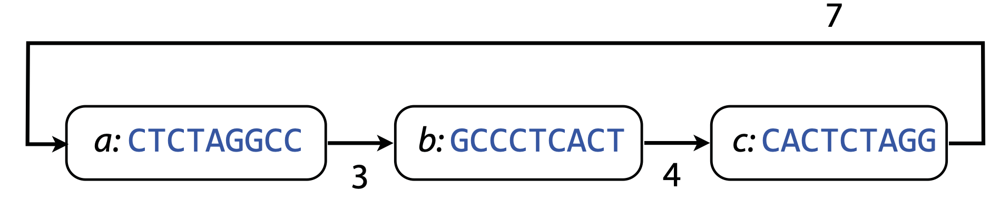

Note: Cycles are possible if the sequenced genome is circular (bacterial genomes, mitochondrial DNA). And in the case of repeats — a repeated sequence can overlap with itself, creating a cycle in the graph. Cycles complicate the layout step. For circular genomes, we expect exactly one cycle covering all nodes. For repeats, cycles indicate assembly ambiguity.

---

## An example digraph
<small>GCATTATATATTGCGCGTACGGCGCCGCTACA, read-length : 7, minimum overlap : 3</small><br>
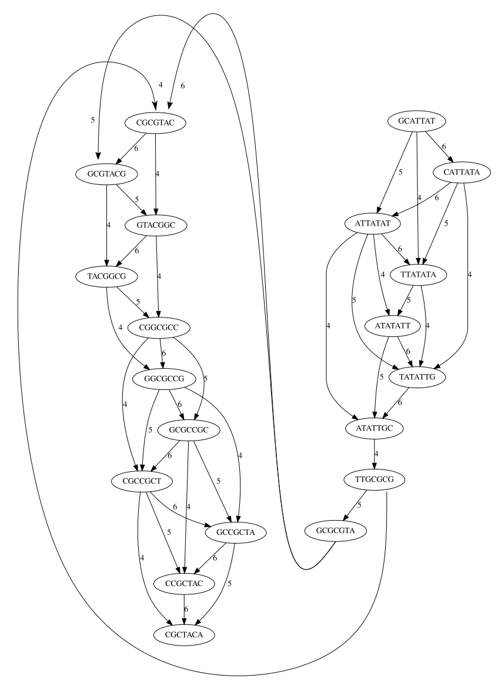 <!-- .element width="40%" height="40%" -->

Note: In order to keep the presentation uncluttered, we are not showing the treatment of the reverse complements. In a real assembler, we would also consider reads from the reverse strand. Each node is a read (7-mer from the original sequence), and each edge represents an overlap of at least 3 bp. The sequence contains TATATA as a repeat, which creates edges going back and forth between repeat-containing reads.

---

## Overlap Layout Consensus
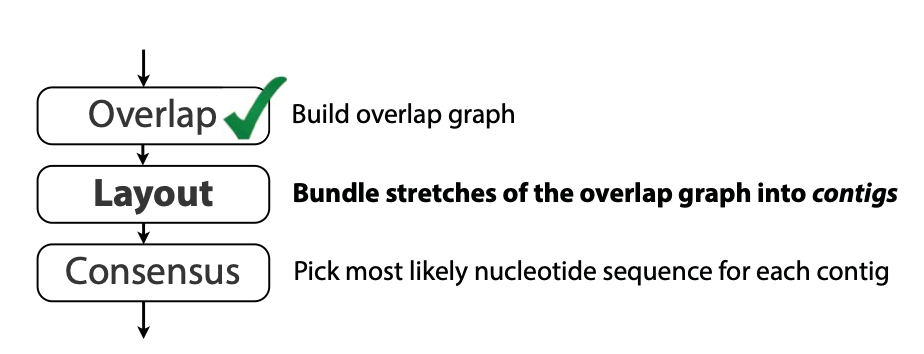 <!-- .element width="90%" height="90%" -->

Note: After building the full overlap graph, we move to the layout phase. The overlap graph for real data is very dense — most reads overlap many other reads. The first step of layout is to simplify the graph by removing edges that are implied by other edges (transitive reduction). This makes the underlying linear structure of the genome visible.

---

## Layout
The overlap graph is big and messy.

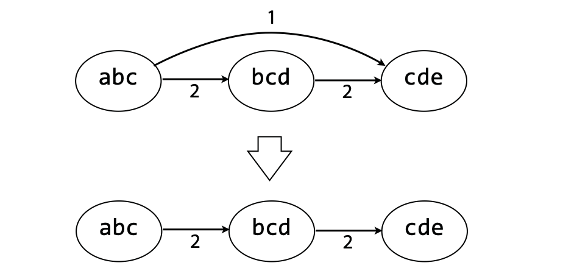 <!-- .element width="80%" height="80%" -->

Note: But the picture gets clearer after removing transitively-inferrable edges. A transitive edge is one that "skips" intermediate reads — if read A overlaps B, B overlaps C, and A also overlaps C, then the A→C edge is redundant (it is implied by A→B→C). Removing these redundant edges reveals the backbone of the assembly.

---

## Layout
Remove transitively-inferrable edges<br>
 <!-- .element width="40%" height="40%" -->

Note: Starting from the full overlap graph — every pair of reads with sufficient overlap has an edge. This graph is dense and hard to interpret. We will now remove edges one by one, starting with those that skip just one intermediate node.

---

## Layout
Removing edges that skip one node.<br>
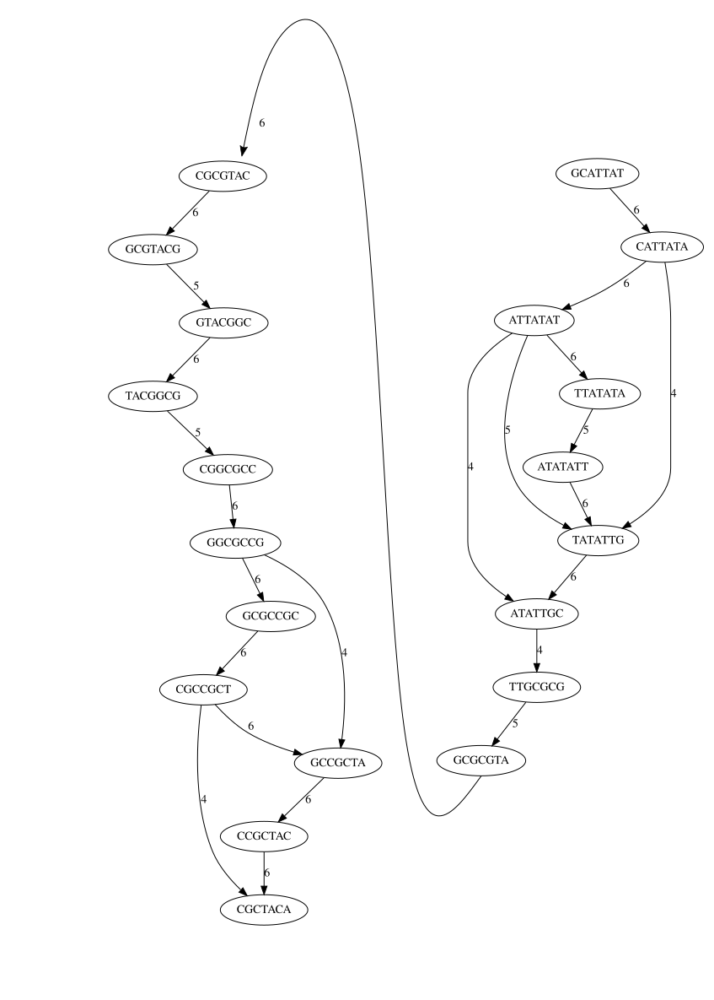 <!-- .element width="40%" height="40%" -->

Note: An edge from A to C is removed if there exists a node B such that A→B and B→C both exist (A→C is implied by transitivity through B). After this step, we have removed the most obvious redundant edges. The graph is simpler but may still have edges that skip two or more nodes.

---

## Layout
Removing edges that skip two nodes.<br>
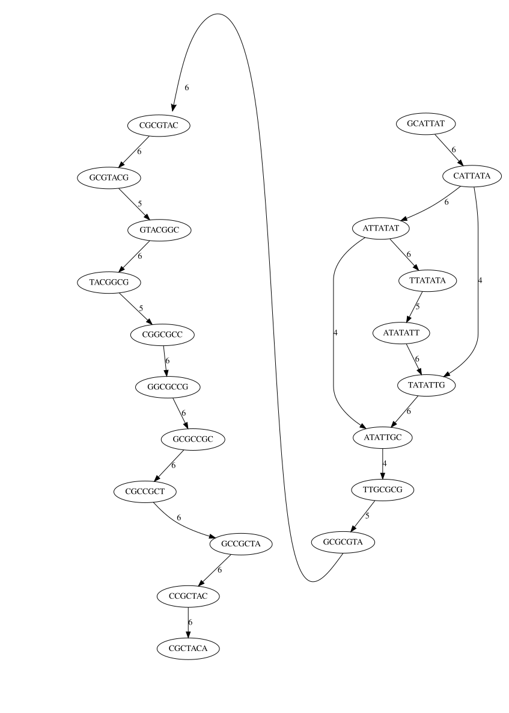 <!-- .element width="40%" height="40%" -->

Note: Now removing edges implied through paths of length 2 (two intermediate nodes). The graph continues to simplify. Ask students: will this process always terminate? Yes — the graph is finite and we only remove edges, never add them.

---

## Layout
Removing edges that skip three nodes.<br>
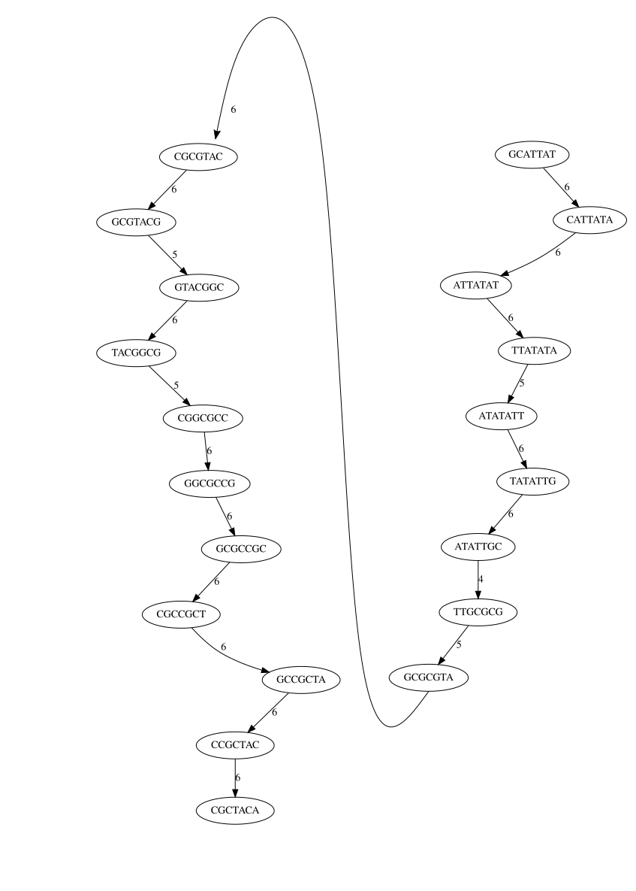 <!-- .element width="40%" height="40%" -->

Note: After transitive reduction, the graph ideally becomes a simple linear path (for a linear genome with no repeats) or a small number of paths. In practice, repeats, errors, and ploidy create branches and bubbles that require further processing.

---

## Layout
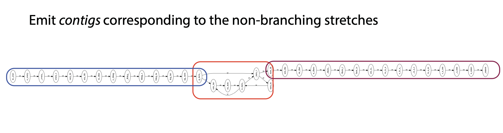 <!-- .element width="95%" height="95%" -->

Note: Can someone tell me what could be the cause of the branches? Branches arise from: (1) repeats — a repeated sequence creates multiple valid continuations from the same node; (2) sequencing errors — an erroneous read may create a false overlap; (3) heterozygosity — two haplotypes of the same region create two slightly different paths through the graph.

---

## Repeats
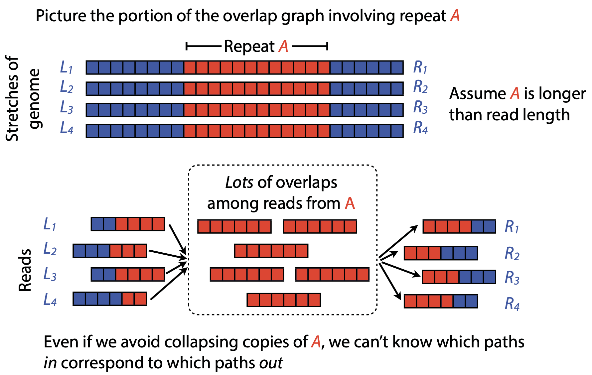 <!-- .element width="95%" height="95%" -->

Note: This is why longer reads are extremely helpful for genome assembly. If a read is longer than the repeat, it spans the entire repeat and uniquely places itself in the assembly, resolving the ambiguity. For recent human genome assemblies, long reads from PacBio HiFi or Oxford Nanopore technologies — sometimes supplemented with Hi-C conformation capture data — allow assembly of near-complete chromosomes.

---

## Layout
In practice, layout step also has to deal with spurious subgraphs, e.g. because of sequencing error

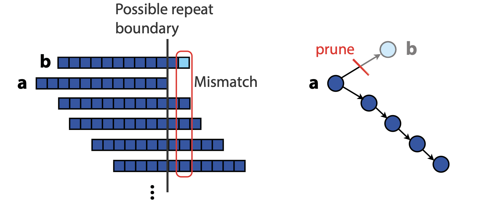 <!-- .element width="95%" height="95%" -->

Note: Mismatch could be due to sequencing error or repeat. Since the path through b ends abruptly we might conclude it's an error and prune b. In practice, coverage information helps here: a spurious branch from an error will typically have much lower read coverage than the true path. Assemblers use coverage thresholds to prune likely error branches.

---

## Overlap Layout Consensus
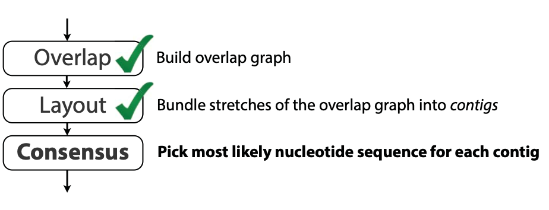 <!-- .element width="90%" height="90%" -->

Note: After the layout step produces a simplified graph and a set of paths (contigs), we enter the consensus phase. Each contig is a sequence of overlapping reads. At each position in the contig, multiple reads contribute a base call — we need to determine the most likely true base, accounting for sequencing errors.

---

## Consensus
 <!-- .element width="95%" height="95%" -->

Note: The layout gives us the ordering and orientation of reads along each contig. Now we need to collapse the multiple overlapping reads into a single consensus sequence. Think of this as a multiple sequence alignment problem — all reads covering a given position are "stacked up" and we call the most likely base, weighted by base quality scores.

---

## Consensus
 <!-- .element width="70%" height="70%" -->

Note: At each position, ask: what nucleotide (and/or gap) is here? We use a majority-vote or probabilistic model that takes base quality scores into account. Complications: (a) sequencing error — a true base may be miscalled in some reads; (b) ploidy — at a heterozygous site, two different bases are both correct. Most assemblers call the more frequent allele for haploid assemblies, or output both for diploid-aware assemblers.

---

## Overlap Layout Consensus
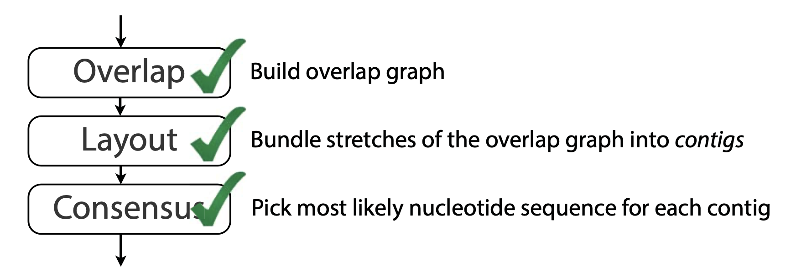 <!-- .element width="70%" height="70%" -->

Note: Main drawback of OLC is that building the overlap graph requires all-vs-all read comparison, which is O(N^2) — slow for NGS data where we have billions of reads. For long reads (PacBio HiFi, Oxford Nanopore), OLC is still the method of choice because long reads make overlaps easier to detect and repeats easier to span. Building a consensus also requires heuristics to determine the number of repeat units, for example.

---

## From contigs to scaffolds

* Assembly produces **contigs** — contiguous sequences with no gaps
* But we want **scaffolds** — ordered, oriented contigs spanning larger regions
* How do we order and orient contigs?

Note: After assembly, we typically have thousands of contigs. We know the sequence within each contig, but we don't know the order, orientation, or distance between them. Scaffolding uses additional experimental data to stitch contigs together into larger structures. The gaps between contigs within a scaffold are represented as runs of Ns of known approximate length.

---

## Paired-end reads

* Sequence **both ends** of a DNA fragment of known size
* Gives two reads with a known approximate **insert size**
* If the two reads land in different contigs → those contigs are **adjacent** in the genome

```text
Fragment: |←—————— ~500 bp ——————→|
               Read 1 ——→      ←—— Read 2
```

Note: Paired-end sequencing is now standard for Illumina. The two reads from one fragment are called a "read pair" or "mate pair." Mate pairs use larger insert sizes (3–40 kb) and are made differently (circularization) but serve the same purpose. The key information is: if read 1 maps to contig A and read 2 maps to contig B, then A and B are separated by approximately the insert size minus the two read lengths. Many such pairs linking the same two contigs give high confidence in the adjacency.

---

## Scaffolding

* Collect all read pairs where each read maps to a **different** contig
* These pairs provide **linking** information:
  * Which contigs are adjacent
  * Approximate **distance** between them
  * Relative **orientation** of the contigs
* Build a scaffold graph: contigs are nodes, links are edges with distance estimates
* Find paths through the scaffold graph → scaffolds

Note: Scaffolding is essentially another graph problem layered on top of assembly. The scaffold graph is much simpler than the assembly graph — contigs are already assembled, and we just need to order them. Tools like SSPACE, BESST, or LINKS perform scaffolding. Modern long-read assemblies often skip traditional scaffolding because the long reads already span the gaps — but for Illumina-only assemblies, scaffolding is essential for producing chromosome-scale sequences.

---

## Two approaches to short read assembly
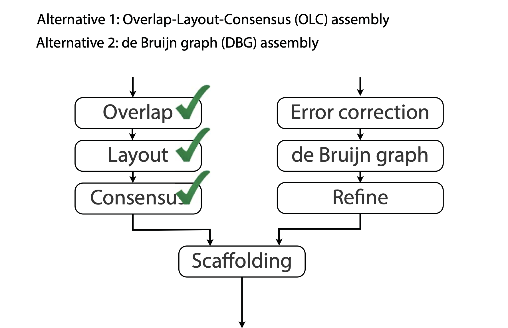 <!-- .element width="80%" height="80%" -->

Note: For short reads (Illumina, ~150bp), OLC is too slow — billions of reads means trillions of pairs to check. The De Bruijn graph approach sidesteps this by working with k-mers instead of reads. Rather than finding overlaps between reads, we decompose every read into its constituent k-mers and build a graph of k-mer overlaps. K-mer counts can be computed in linear time using hash tables, making this approach scalable to billions of reads.

---

## De Bruijn graph
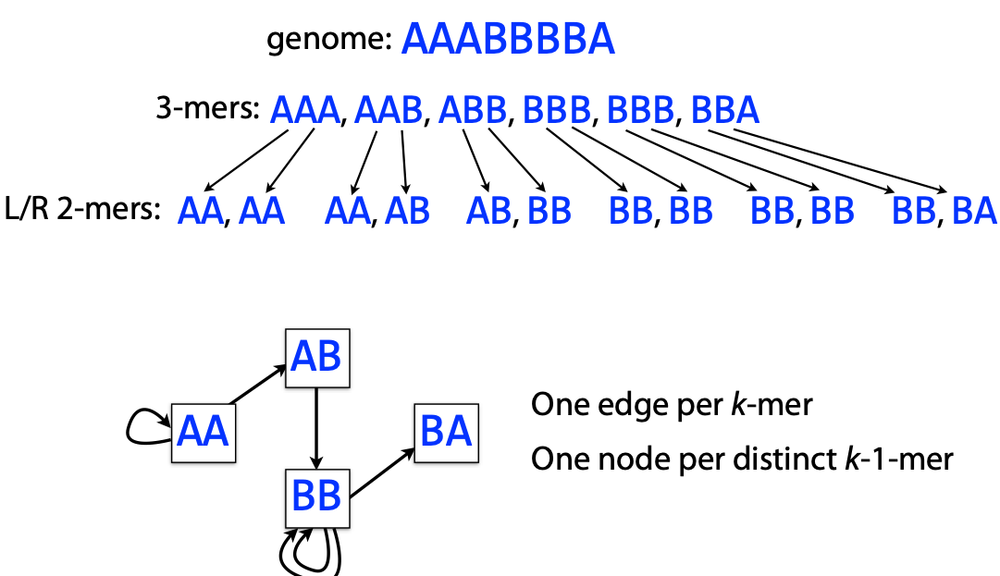

Note: A De Bruijn graph is a graph where nodes are (k-1)-mers and edges are k-mers. Each k-mer in the genome contributes exactly one edge. A path through the graph that visits every edge exactly once (an Eulerian walk) reconstructs the original sequence. This reformulates assembly as finding an Eulerian walk — solvable in linear time — rather than a Hamiltonian path, which is NP-hard.

---

## De Bruijn graph
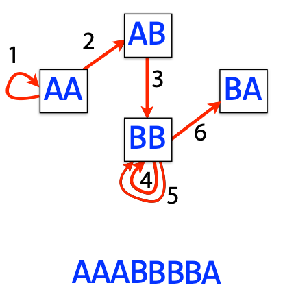

A walk crossing each edge exactly once gives a reconstruction of the genome. This is an Eulerian walk.

Note: Key insight: OLC tries to find a Hamiltonian path — visiting each node (read) exactly once. Hamiltonian path is NP-hard in general. De Bruijn graphs reformulate assembly as finding an Eulerian walk — visiting each edge (k-mer) exactly once. Eulerian walks can be found in O(|E|) time. This is why De Bruijn graphs are tractable at genome scale.

---

## Eulerian walks
* Node is balanced if indegree equals outdegree
* Node is semi-balanced if indegree differs from outdegree by 1
* Graph is connected if each node can be reached by some other node
* Eulerian walk visits each edge exactly once
* Not all graphs have Eulerian walks.


A directed, connected graph is Eulerian if and only if it has at most 2 semi-balanced nodes and all other nodes are balanced <!-- .element class="fragment" data-fragment-index="1" -->

Note: The Eulerian condition is elegant and easy to check in O(|V|) time. For an undirected graph, the analogous condition is that at most 2 nodes have odd degree — this is the Königsberg bridge problem. Semi-balanced nodes serve as the start and end of the walk. If all nodes are balanced, the walk is an Eulerian circuit (starts and ends at the same node — appropriate for circular genomes).

---

## Eulerian walks


AA and BA are semi-balanced, AB and BB are balanced

Note: AA has one more outgoing edge than incoming (semi-balanced — walk starts here). BA has one more incoming than outgoing (semi-balanced — walk ends here). AB and BB have equal in/out degree (balanced). Work through the walk with students: start at AA, follow edges, visit every edge exactly once, end at BA. The walk uniquely reconstructs the sequence in this simple, repeat-free case.

---

## Constructing De Bruijn graph

* Pick a substring length $k$
* For each *k*-mer in the string
    * Split *k*-mer into left and right *k-1*-mers
    * Add *k-1*-mers as nodes to de Bruijn graph
    * Add edge from left *k-1*-mer to right *k-1*-mer

$k$ is typically chosen to be odd, so a *k*-mer is not its own reverse complement. Example: TCGCGA

Note: When the first half of the k-mer is the reverse complement of the second half, the k-mer is its own reverse complement — choosing odd k avoids this. The choice of k is a critical parameter: too small and many k-mers are repeated by chance, causing tangles in the graph; too large and sequencing errors prevent k-mers from being seen multiple times, creating gaps. Typical values: k=21–127 for Illumina data. Many assemblers try multiple values of k and merge results.

---

## Constructing De Bruijn graph
<small>Sequence : GTGCGCTAATCGGAGACGAATTTAAGACAC</small><br>
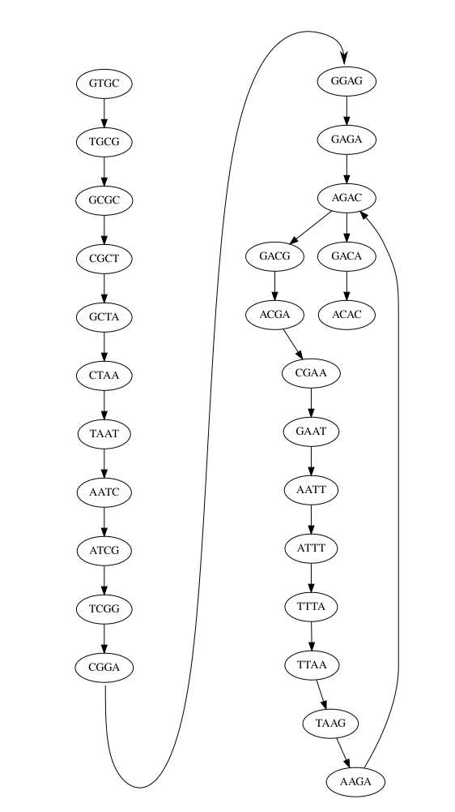 <!-- .element width="30%" height="30%" -->

Note: Walk through the construction for this sequence with a small k. Each k-mer becomes an edge; each (k-1)-mer becomes a node. For a sequence with no repeats, the graph is a simple path and the Eulerian walk trivially reconstructs the sequence. Ask students to verify that the graph is Eulerian by checking in/out degrees.

---

## Constructing De Bruijn graph
<small>Sequence : GTGCGC<span style="color:red">TAATCGGAGACGAATTTAAG</span>ACAC<span style="color:red">TAATCGGAGACGAATTTAAG</span></small><br>
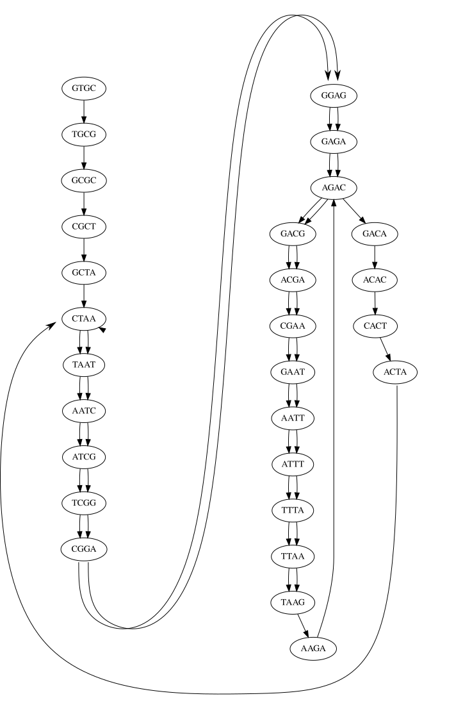 <!-- .element width="37%" height="37%" -->

Note: Now the sequence has a repeat (shown in red). The repeat region produces a node in the De Bruijn graph with two incoming and two outgoing edges — a "repeat node." There are two valid Eulerian walks through this graph, corresponding to two possible assemblies. Without additional information, we cannot determine which is correct. Addition of the repeat does not increase the number of nodes significantly — edges increase, but we can replace parallel edges with edge weights.

---

## De Bruijn graph
For a Eulerian graph, Eulerian walk can be found in $O(|E|)$ time.

Note: |E| is the number of edges. Convert graph into one with Eulerian cycle (add an edge to make all nodes balanced). Start from a node and keep visiting unvisited edges until returning to the start. It is not possible to get stuck at any vertex other than the start, because indegree and outdegree of every vertex are equal — when the trail enters a vertex w there must be an unused edge leaving w. As long as there exists a vertex u that belongs to the current tour but has adjacent edges not yet in the tour, start another trail from u, follow unused edges until returning to u, and join the new trail to the previous tour.

---

## De Bruijn graph: repeats cause ambiguity
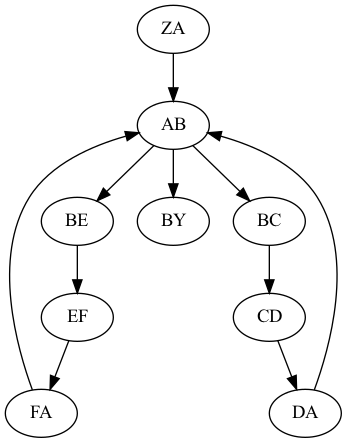 <!-- .element width="30%" height="30%" -->

The repeat AB appears three times. Two valid Eulerian walks give different assemblies:

Walk 1: ZA→AB→BE→EF→FA→AB→BC→CD→DA→AB→BY

Walk 2: ZA→AB→BC→CD→DA→AB→BE→EF→FA→AB→BY

Note: This is the fundamental problem with repeats in De Bruijn graphs. When we traverse the edge AB, we cannot tell which copy of the repeat we are at — leading to multiple valid Eulerian walks, each corresponding to a different (possibly incorrect) genome sequence. Both walks are equally valid from the graph alone. Only external information — long reads that span the repeat, paired-end distances, or Hi-C contacts — can resolve which walk is correct.

---

## De Bruijn graph
* Repeats still cause misassembles
* Real datasets have sequencing errors
* Gaps in coverage lead to disconnected or non-Eulerian graph
* Difference in coverage can make graph non-Eulerian

Note: Casting assembly as an Eulerian walk is appealing but not directly practical on real data. Uneven coverage, sequencing errors, and repeats all violate the conditions needed for a clean Eulerian walk. In practice, assemblers break the graph at ambiguous nodes, producing multiple shorter contigs rather than a single sequence, then use additional data to link and resolve them.

---

## Graph Topology based error-correction
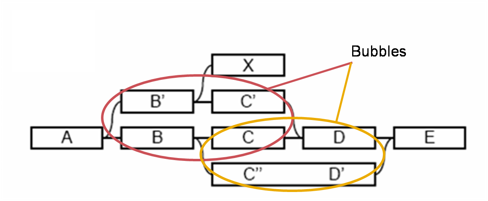

Note: Sequencing errors create "bubbles" and "tips" in the De Bruijn graph. A bubble forms when two slightly different paths connect the same two nodes — one path represents the correct sequence, the other an error. Since errors are rare, the correct path will have much higher coverage. Assemblers like Velvet detect and pop these bubbles by collapsing both paths to the higher-coverage one. A "tip" is a short dead-end branch caused by errors at the beginning or end of a read; these are pruned by length and coverage thresholds.

---

## *k*mer based error correction
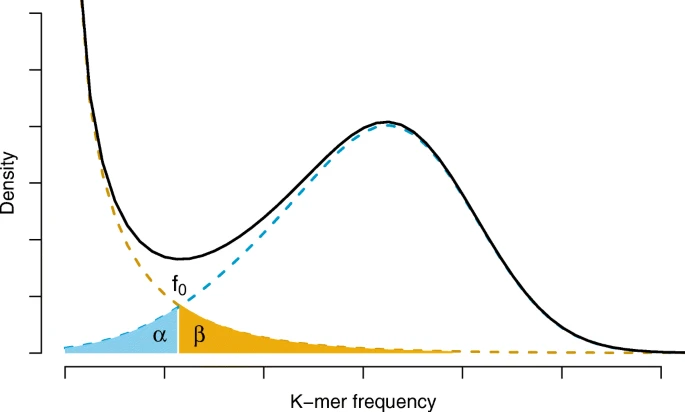

<small>[PMC6311904](https://www.ncbi.nlm.nih.gov/pmc/articles/PMC6311904/)</small>

Note: Frequency distribution of both error-free and error-containing k-mers for a NGS dataset. The frequency distribution of erroneous k-mers is represented by the dashed orange line, while correct ones are shown as dashed sky-blue. The solid black line is the distribution of all k-mers. The key insight: true k-mers appear many times (once per read covering that position), while error k-mers appear very rarely (only in the read carrying the error). We set a frequency threshold f0 — k-mers below it are treated as errors and corrected or discarded before assembly.

---

## Summary

| | OLC | De Bruijn |
|---|---|---|
| **Graph nodes** | Reads | $(k-1)$-mers |
| **Graph edges** | Pairwise overlaps | $k$-mers |
| **Path sought** | Hamiltonian (NP-hard) | Eulerian ($O(\|E\|)$) |
| **Strength** | Works well with long reads | Efficient for short reads |
| **Weakness** | $O(N^2)$ overlap detection | Sensitive to repeat length vs $k$ |
| **Examples** | Canu, Hifiasm, Verkko | Velvet, SPAdes, ABySS |

Note: The choice of assembler depends on the sequencing technology. Short-read data (Illumina) → De Bruijn assemblers (SPAdes is the current standard). Long-read data (PacBio HiFi, Oxford Nanopore) → OLC assemblers (Hifiasm, Verkko). Hybrid approaches use both — long reads resolve repeats, short reads correct errors. The T2T assembly of the complete human genome in 2022 used long accurate PacBio HiFi reads and resolved all centromeres and telomeres for the first time.

---

## Evaluating an assembly: the problem with simple metrics

* **Total length**: easy, but a million tiny contigs can equal one chromosome
* **Number of contigs**: fewer is better, but one huge misassembly is worse than many correct small ones
* **Longest contig**: ignores the rest of the assembly
* We need a metric that captures **contiguity** across the whole assembly

Note: Imagine two assemblies of the same genome: assembly A has 10 contigs of 100 Mb each; assembly B has 1 million contigs of 1 kb each. Total length is the same but assembly A is far more useful. Simple counts don't capture this. We need a statistic that rewards assemblies where a large fraction of the genome is in long contigs.

---

## N50

* Sort all contigs by length, longest first
* Walk down the sorted list, summing lengths
* **N50** = length of the contig at which the cumulative sum reaches **50% of the total assembly length**

```text
Contigs (sorted): 10 Mb, 8 Mb, 5 Mb, 3 Mb, 2 Mb, 1 Mb, ...
Total length: 30 Mb
50% = 15 Mb → reached after 10 + 8 = 18 Mb → at the 8 Mb contig
N50 = 8 Mb
```

Note: A higher N50 means the assembly is more contiguous — half the genome is in contigs at least this long. N50 is the most widely reported assembly metric. Intuition: if you picked a random base in the assembly, there is a 50% chance it sits on a contig at least N50 bases long. Walk students through the worked example. Common mistake: students confuse N50 with the median contig length — they are very different things.

---

## NG50 and other metrics

* **NG50**: same as N50 but uses the **known genome size** as the denominator instead of the assembly length
  * More meaningful when the assembly is incomplete (assembled length < true genome length)
* **L50**: the **number** of contigs needed to reach 50% of the assembly — fewer is better
* **BUSCO**: checks for the presence of conserved single-copy genes expected in the species
  * Captures **completeness** and **accuracy**, not just contiguity
* **QV (quality value)**: estimates base-level accuracy from k-mer comparisons

Note: NG50 is preferred when comparing assemblies of different completeness — if one assembly is 90% of the genome and another is 80%, their N50s are not directly comparable but their NG50s (using true genome size) are. BUSCO (Benchmarking Universal Single-Copy Orthologs) is now standard for evaluating gene-space completeness — a good assembly should have >95% of expected BUSCOs present and single-copy. QV (used by the T2T consortium) measures the probability that a given base call is wrong, analogous to Phred quality scores for reads.

---

## Glossary: biology terms for CS students

| Term | Definition |
|------|-----------|
| **Contig** | A contiguous assembled sequence with no internal gaps |
| **Scaffold** | Ordered, oriented contigs connected by known-size gaps (Ns) |
| **Coverage / depth** | Average number of reads covering each position in the genome |
| **Paired-end reads** | Two reads sequenced from opposite ends of a DNA fragment of known size |
| **Ploidy** | Number of copies of each chromosome (humans are diploid: 2 copies) |
| **Repeat** | A sequence occurring multiple times in the genome, causing assembly ambiguity |
| **Conformation capture (Hi-C)** | Experiment that measures 3D proximity between genomic loci; used to scaffold assemblies |

---

## Glossary: CS terms for biology students

| Term | Definition |
|------|-----------|
| **De Bruijn graph** | Graph where nodes are $(k-1)$-mers and edges are $k$-mers from the sequence |
| **Eulerian walk** | A path through a graph that visits every **edge** exactly once |
| **Hamiltonian path** | A path through a graph that visits every **node** exactly once; NP-hard to find |
| **Transitive reduction** | Removing edges implied by longer paths; simplifies the overlap graph |
| **Hash table** | Data structure for O(1) average-time lookup; used for k-mer counting |
| **N50** | Contig length such that 50% of the assembly is in contigs at least this long |
| **BUSCO** | Measure of assembly completeness based on presence of conserved single-copy genes |

---
