## Sequence alignments
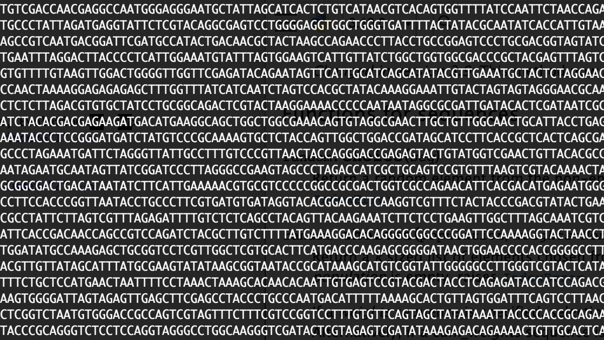 <!-- .element height="80%" width="80%" -->

Note: This lecture covers the algorithmic foundations of sequence alignment — one of the most fundamental operations in computational biology. We will go from the simplest string comparison (substring matching), through dynamic programming (the core technique), to practical tools like BLAST that make alignment work at genome scale. Glossary slides are at the end for both CS and biology students.

---

## Why might we want to align sequences?

* Detect orthologs
* Identify functional elements
* Understand neo-functionalization of genes
* Identify variants in a population
* ...

Note: Orthologs are genes in different species that evolved from a common ancestor — alignment lets us find them. Neo-functionalization is when a duplicated gene acquires a new function; alignment helps us detect the divergence. Variant calling (e.g., in clinical genomics) depends entirely on aligning patient reads to a reference. The point here is that alignment is not just an abstract algorithm — it underpins most of modern genomics.

---

## All species share common ancestry
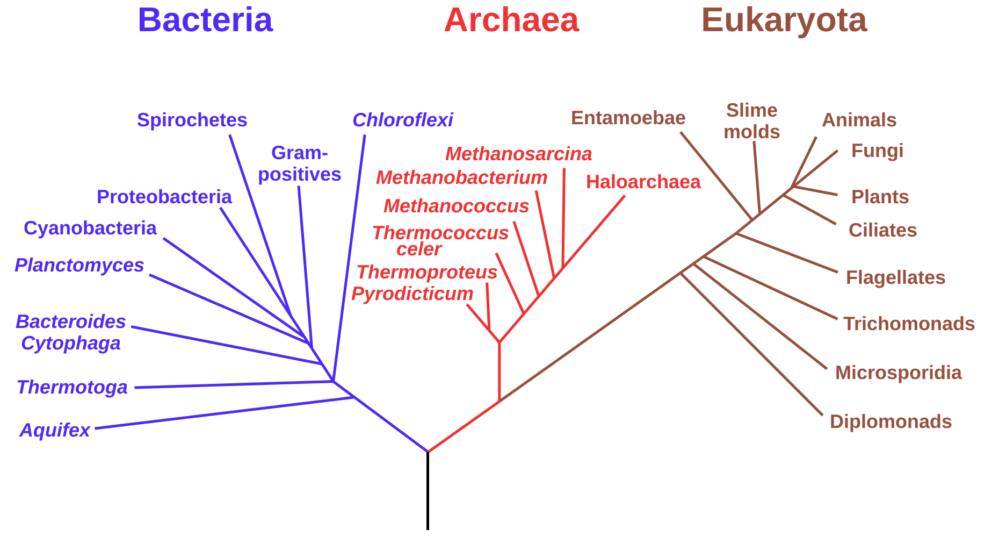 <!-- .element height="80%" width="80%" -->

<small>Source : [Wikipedia](https://commons.wikimedia.org/wiki/File:Phylogenetic_tree.svg)</small>

Note: A phylogenetic tree of living things, based on ribosomal RNA data and proposed by Carl Woese in 1977, showing the separation of bacteria, archaea, and eukaryotes. Trees constructed with other genes are generally similar, although they may place some early-branching groups very differently, thanks to long branch attraction. The exact relationships of the three domains are still being debated, as is the position of the root of the tree. It has also been suggested that due to lateral gene transfer, a tree may not be the best representation of the genetic relationships of all organisms. For instance some genetic evidence suggests that eukaryotes evolved from the union of some bacteria and archaea (one becoming an organelle and the other the main cell).

---

## Genome-wide alignments reveal orthologous segments
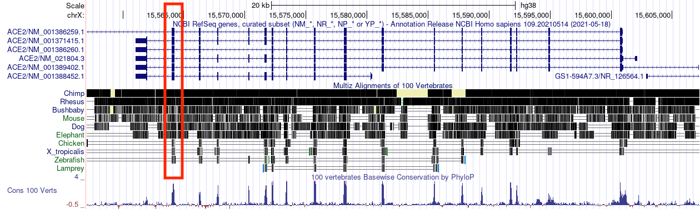

Note: This shows the ACE2 locus — the receptor SARS-CoV-2 uses to enter cells. By aligning genomes of multiple species, we can identify the orthologous gene in each. The colored blocks represent syntenic (same-order) regions. This kind of analysis was critical during COVID-19 for understanding which animal species might be susceptible to infection based on their ACE2 sequence similarity to humans.

---

## Comparative genomics reveals functional elements
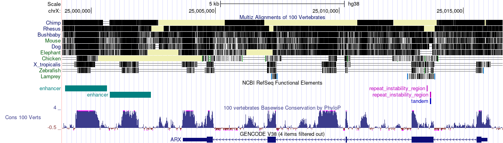

Note: Regions that are conserved across species are likely under selective pressure, meaning they have a function. This is one of the most powerful applications of alignment — you can predict function without any experimental data, purely from evolutionary conservation. Non-coding conserved regions are often regulatory elements (enhancers, promoters).

---

## What makes us human?

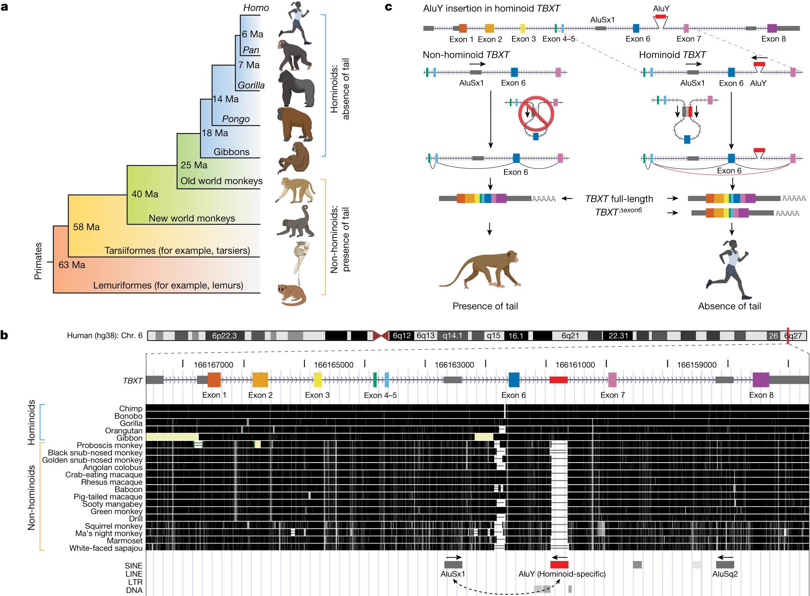 <!-- .element height="80%" width="80%" -->

Source: PMC10901737

Note: This is a striking example of alignment as a discovery tool. This study found that an Alu transposable element inserted into the TBXT gene in the ancestor of great apes. By aligning the TBXT locus across primates, they showed this insertion is present in all tailless apes but absent in tailed monkeys. When they engineered this insertion into mice, the mice lost their tails — directly linking a sequence change found by alignment to a major morphological trait. 

---

## How do we actually align two sequences?
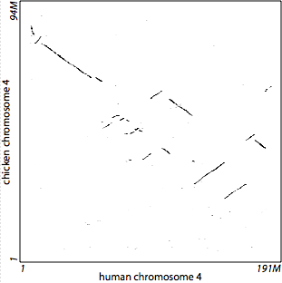

Note: This is the central question of the lecture. We can see visually that these sequences are related, but we need a rigorous algorithm to produce the alignment and quantify how similar they are. The rest of the lecture builds up the tools to do this — starting from simple substring matching, through dynamic programming, to practical database search tools like BLAST.

---

## Outline
1. Introduction to sequence alignment
2. Dynamic programming for sequence alignments
3. Exact matching
4. Database search
5. Short-read alignment

Note: We start with motivation and simple formulations (substring, subsequence), build up to the full DP solution (Needleman-Wunsch, Smith-Waterman), then shift to practical tools. The progression is: what problem are we solving, why is it hard, how do we solve it efficiently, and how do real-world tools (BLAST) make it scalable.

---

## Genomes change over time
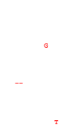 <!-- .element height="30%" width="30%" -->

Note: Over evolutionary time, genomes accumulate substitutions, insertions, and deletions. In this toy example, we see a series of operations that convert a genome into another genome.

---

## Goal of genome alignment

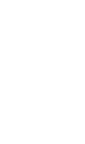 <!-- .element height="30%" width="30%" -->

Note: The goal of genome alignment is to identify the set of operations that changed a sequence into another sequence. 

---

## Goals of genome alignment
 <!-- .element height="80%" width="80%" -->

Note: In the real world, the situation is a little more complicated. We do not have sequence from the ancestor and an extant relative. We typically have genomic sequence from two extant or living species, both of which have shared a common ancestor at some point in the past. So in some ways, we are looking to decipher the operations on both the branches going up to the common ancestor.

---

## Formalizing the problem
 <!-- .element height="50%" width="50%" -->

* Define a set of evolutionary operations
  * Assumption : Symmetric operations
* Define optimality criterion
  * min (\# of operations) $\ldots$
* Design algorithm that achieves optimality
  * Assumptions influence performance

Note: The evolutionary operations we consider are insertions, deletions, and substitutions. Minimum cost of operations can be another optimality criterion. When comparing human and mouse, pairwise alignment models the differences between the two sequences using substitutions, insertions, and deletions — without explicitly reconstructing the ancestral sequence. Remember that it is impossible to infer the exact series of operations (Occam's razor — we prefer the simplest explanation). We want to design an algorithm that achieves optimality or at least can approximate it. If we can provide concrete bounds on that approximation then that is the ideal case.

---

## Formalizing the problem
 <!-- .element height="50%" width="50%" -->

* Define a set of evolutionary operations
  * Assumption : Symmetric operations
* Define optimality criterion
  * min (\# of operations) $\ldots$
* Design algorithm that achieves optimality
  * Assumptions influence performance

Note: We will flip the direction of one of the arrows to make our lives easier.

---

## Algorithmic complexity

Big-O notation: upper bound on complexity 
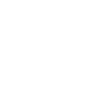 <!-- .element height="50%" width="50%" -->

<small>Recommended reading: Chapter 3, "Growth of functions" in [The Big Book](https://search.lib.virginia.edu/?mode=basic&q=keyword:+{Introduction+to+Algorithms}&pool=uva_library)</small>

Note: Two fundamental questions we ask about any algorithm: (1) How long does it take given input of size n? (time complexity), and (2) How much memory does it need? (space complexity). Big-O gives an upper bound — to the right of n0, f(n) is always below c*g(n) for some constant c. This captures worst-case scaling behavior and we can say that the function we are interested in is O(g(n)). Think of it as "if I double the sequence length, how much longer does it take?" O(n) means twice as long, O(n^2) means four times as long, O(2^n) means impossibly longer. Usually we want to improve the order of growth g(n), but sometimes reducing the constant factor matters too — an O(n^2) algorithm with a small constant can beat an O(n log n) algorithm for practical input sizes.

---

## Order of growth
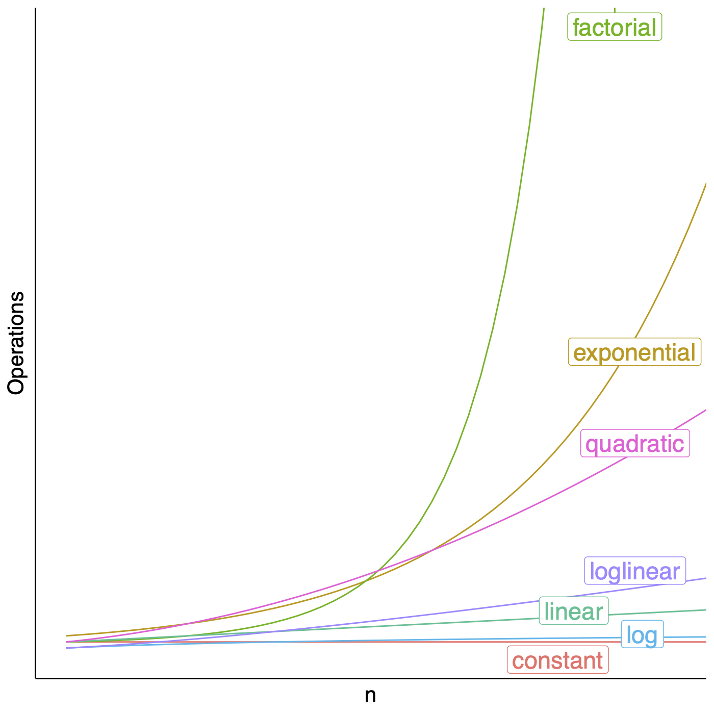 <!-- .element height="50%" width="50%" -->

Note: There are some g(n) functions that are more commonly used than others.

---

## Longest common substring

Given two possibly related strings $x$ and $y$, what is the longest common substring (no gaps)?

```text
x : TCACCTGACCTCCAGGC
y : TCATGACCGCCATGGC
```

```text
x : TCACCTGACCTCCAGGC
    |||xxxxxx|xxxx|x
y : TCATGACCGCCATGGC
```
<!-- .element: class="fragment" data-fragment-index="1" -->

Note: For these two strings, what is the simplest way to compare them? The longest common substring requires the matching characters to be contiguous — no gaps allowed. We are sliding one sequence past the other and looking for the longest run of matches. This is the simplest formulation, and we will see it is too restrictive for biological sequences because real alignments need gaps.

---

## Longest common substring

Given two possibly related strings $x$ and $y$, what is the longest common substring (no gaps)?

```text
x : TCACCTGACCTCCAGGC
y : TCATGACCGCCATGGC
```

```text
x : TCACCTGACCTCCAGGC
     xxxxxxx|xx|xx|||
y :  TCATGACCGCCATGGC
```

Note: At this offset, we get a different set of matches. The longest contiguous run here is only 3 (the last three characters). Point out to students: the answer depends on the offset, and we need to try all of them to find the global maximum. This is what makes the brute-force approach quadratic.

---

## Longest common substring

Given two possibly related strings $x$ and $y$, what is the longest common substring (no gaps)?

```text
x : TCACCTGACCTCCAGGC
y : TCATGACCGCCATGGC
```

```text
x : TCACCTGACCTCCAGGC
         |||||
y :   TCATGACCGCCATGGC
```

Note: At this offset we find a run of 5 consecutive matches — GACCT vs GACCG... wait, only GACC matches (4). The point is that the longest common substring for these sequences is relatively short. This is typical for real biological sequences that have undergone insertions and deletions — contiguous matching is too rigid. This motivates allowing gaps, which leads us to the longest common subsequence.

---

## Longest common substring

Given two possibly related string $x$ and $y$, what is the longest common substring (no gaps)?

```python
max_run_length = 0

for i in range(0, len(x)):
    maxr = longest_run(x, i, min(len(x), i+len(y)), 
                       y, 0, min(len(y), len(x)-i))
    if maxr > max_run_length: max_run_length = maxr

for i in range(0, len(y)):
    maxr = longest_run(x, 0, len(y)-i, y, i, len(y))
    if maxr > max_run_length: max_run_length = maxr

print(max_run_length)
```

Note: Walk through the code: the two loops try every possible offset of x relative to y. At each offset, longest_run counts the longest stretch of consecutive matches. This is O(n*m) — quadratic in the sequence lengths. For two 1000-base sequences, that is 1 million comparisons, which is fine. But this only finds contiguous matches — it cannot handle insertions or deletions. That limitation motivates the longest common subsequence.

---

## Longest common subsequence

* A subsequence is a sequence that appears in the same relative order, but not necessarily contiguous
  * abc, abg, bdf, $\ldots$ are subsequences of abcdefg

* Given two possibly related string $x$ and $y$, what is the longest common subsequence? 

```text
x : TCACCTGACCTCCAGGC
y : TCATGACCGCCATGGC
```

```text
x : TCACCTGACCTCCA-GGC
    |||  |||||x||| |||
y : TCA--TGACCGCCATGGC
```

Note: Key distinction for CS students: substring = contiguous, subsequence = same order but can skip positions. For biology students: a subsequence allows gaps, which is exactly what we need because genomes accumulate insertions and deletions. The LCS is closely related to the edit distance (minimum number of insertions, deletions, and substitutions to transform one string into another). For now we treat all mismatches and gaps equally — this is simplistic but lets us focus on the algorithmic structure. We will relax this assumption when we move to scored alignment.

---

## Brute-force approach

* $|x|=n,\ |y|=m, \ n > m$
* Longest alignment : $n+m$ entries
* Alignment is a gap-placement algorithm
* ${n+m \choose n}$ ways of placing gaps in $y \approx 2^{m+n}$

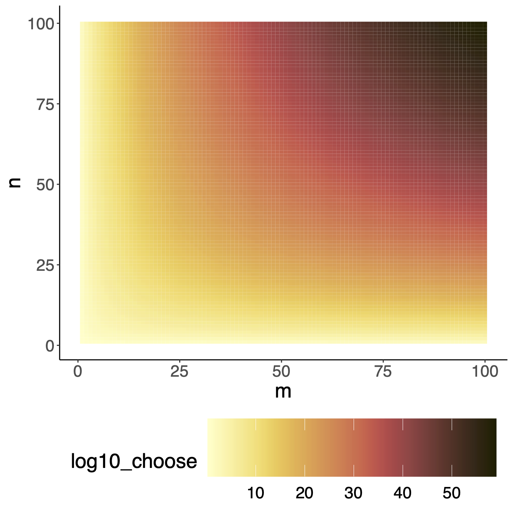 <!-- .element height="30%" width="30%" -->

Note: Why is ${n+m \choose n} \approx 2^{m+n}$? The binomial coefficient ${n+m \choose n}$ counts the number of ways to choose which $n$ of the $n+m$ alignment columns contain a character from $x$ (the rest are gaps). When $m \approx n$, the central binomial coefficient ${2n \choose n} \approx \frac{4^n}{\sqrt{\pi n}}$ by Stirling's approximation, which is exponential in $n$. The key point: the number of possible alignments grows exponentially, so enumerating and scoring them all is not an option. We need a polynomial algorithm — dynamic programming — to find the best alignment amongst this exponential number of candidates.

---

## From LCS to sequence alignment

* LCS treats every position as **match or no match** — all mismatches and gaps are equal
* Biology needs more flexibility:
  * Some substitutions are more likely than others (e.g., A↔G transitions are common in DNA)
  * Gaps (insertions/deletions) should be penalized differently from mismatches
  * Opening a gap may cost more than extending one (affine gap penalties)
* **Sequence alignment** generalizes LCS by introducing a **scoring scheme**:
  * Assign specific scores to matches, mismatches, and gaps
  * Find the alignment that **maximizes** the total score
* The algorithmic structure (dynamic programming) stays the same — only the scoring changes

Note: Think of LCS as a special case of alignment where match=1, mismatch=0, gap=0. When we move to full alignment, we allow negative scores for mismatches and gaps, which lets us distinguish good alignments from bad ones more precisely. This is important because in biology, not all changes are equally likely or equally consequential.

---

## Dynamic Programming in theory
* Hallmarks of dynamic programming
  * Optimal substructure
  * Overlapping sub-problems

<!-- * For optimization problems
  * Optimal choice is made locally
  * Score is added through the search space
  * Traceback common, find optimal path based on the individual choices -->

Note: These two properties are the litmus test for whether DP applies. Optimal substructure: the best solution should contain the best solution for the subset of the problem. Overlapping subproblems: when we recursively break down the problem, we encounter the same prefix alignments over and over. DP exploits this by computing each subproblem once and storing the result. Contrast with greedy algorithms (also require optimal substructure but make irrevocable local choices) — greedy is faster but does not guarantee a global optimum. Dijkstra's shortest path is a classic greedy example that does work optimally due to special structure of the problem.

---

## Coin change problem

Given coin denominations $[1, 3, 4]$ and a target amount $n$, find the **minimum number of coins** to make change for $n$.

* Example: make change for $6$
  * $6 = 1+1+1+1+1+1$ → 6 coins
  * $6 = 3+3$ → 2 coins ✓
* Greedy approach (always pick the largest coin):
  * $6 = 4+1+1$ → 3 coins (not optimal!)
* Greedy fails here — we need dynamic programming

Note: This is a classic CS problem that illustrates why DP is necessary. The greedy approach — always picking the largest coin that fits — gives 3 coins (4+1+1), but the optimal answer is 2 coins (3+3). Greedy fails because the locally optimal choice (picking 4) prevents us from finding the globally optimal solution. This is exactly analogous to sequence alignment: a greedy matcher that always extends the current match might miss a better alignment that requires inserting a gap first.

---

## Coin change: optimal substructure

To make change for amount $n$, the last coin we use has some value $c$.

* The remaining amount is $n - c$
* If our solution for $n$ is optimal, then the sub-solution for $n - c$ **must also be optimal**
* Otherwise, we could improve the overall solution by improving the sub-solution

$$\text{minCoins}(n) = 1 + \min_{c \in \text{coins}} \text{minCoins}(n - c)$$

This is **optimal substructure**: the optimal solution contains optimal solutions to subproblems.

Note: Walk through the logic: suppose the best way to make change for 6 uses a coin of value 3 as the last coin. Then the remaining problem is making change for 3. If we did NOT use the best solution for 3, we could swap in the better solution and improve our answer for 6 — contradicting optimality. This proof-by-contradiction argument is exactly the same structure we will see for sequence alignment, where the optimal alignment of two full sequences contains the optimal alignment of their prefixes.

---

## Coin change: overlapping subproblems

Recursive call tree for $\text{minCoins}(6)$ with coins $[1, 3, 4]$:

```text
                    6
                /   |   \
              5     3     2
            / | \  /|\   /|\
           4  2  1 2 0 -1 1 -1 -2
          ...
```

* $\text{minCoins}(2)$ is computed **multiple times**
* Without memoization: exponential work
* With DP table: compute each subproblem **once** → $O(n \times |\text{coins}|)$

Note: Count the repeated subproblems: minCoins(2) appears at least twice, minCoins(1) appears many more times. A naive recursive implementation would recompute these over and over, leading to exponential time. DP solves this by filling a table from minCoins(0) up to minCoins(6), computing each entry exactly once. This is exactly the same waste we will see in the recursive sequence alignment — aligning the same pair of prefixes gets recomputed exponentially many times without a table.

---

## Coin change: the DP table

Coins: $[1, 3, 4]$, target: $6$

| Amount | 0 | 1 | 2 | 3 | 4 | 5 | 6 |
|--------|---|---|---|---|---|---|---|
| minCoins | 0 | 1 | 2 | 1 | 1 | 2 | 2 |

* Fill left to right: each cell looks back at positions $n-1$, $n-3$, $n-4$
* $\text{minCoins}(6) = 1 + \min(\text{minCoins}(5), \text{minCoins}(3), \text{minCoins}(2)) = 1 + \min(2, 1, 2) = 2$

Note: Walk through filling the table: minCoins(0)=0 (base case). minCoins(1)=1+minCoins(0)=1 (only coin 1 fits). minCoins(2)=1+minCoins(1)=2. minCoins(3)=1+min(minCoins(2), minCoins(0))=1+0=1 (use coin 3). minCoins(4)=1+min(minCoins(3), minCoins(1), minCoins(0))=1+0=1 (use coin 4). minCoins(5)=1+min(minCoins(4), minCoins(2), minCoins(1))=1+1=2. minCoins(6)=1+min(minCoins(5), minCoins(3), minCoins(2))=1+1=2. The answer is 2 coins (two 3s). Notice the pattern: each cell depends on a fixed number of earlier cells, just like in the alignment matrix where each cell depends on three neighbors.

---

## From coins to sequences

| | Coin change | Sequence alignment |
|---|---|---|
| **Subproblem** | min coins for amount $n$ | optimal alignment of prefixes $x[1..i]$, $y[1..j]$ |
| **Optimal substructure** | optimal for $n$ contains optimal for $n-c$ | optimal for $(i,j)$ contains optimal for a smaller prefix pair |
| **Overlapping subproblems** | same amount computed many times | same prefix pair computed many times |
| **Table** | 1D array indexed by amount | 2D matrix indexed by $(i,j)$ |
| **Recurrence** | min over coin choices | max over match, gap-in-x, gap-in-y |

Note: The coin change problem is one-dimensional DP — a single parameter (the remaining amount). Sequence alignment is two-dimensional — two parameters (the prefix lengths). But the structure is identical: define subproblems, write a recurrence, fill a table, and trace back to recover the solution. If you understood coin change, you understand the algorithmic skeleton of Needleman-Wunsch. The only difference is the specific choices at each step and the scoring scheme.

---

## Sequence alignments: Optimal substructure

Let $X=[x_1,\...,x_m]$ and $Y=[y_1,\...,y_n]$ be sequences, and $Z=[z_1,\...,z_k]$ be a LCS of $X$ and $Y$.

1. If $x_m = y_n$, then $z_k = x_m = y_n$ and $Z_{k-1}$ is a LCS of $X_{m-1}$ and $Y_{n-1}$.

2. If $x_m \neq y_n$, then $z_k \neq x_m$ implies $Z$ is a LCS of $X_{m-1}$ and $Y$.

3. If $x_m \neq y_n$, then $z_k \neq y_n$ implies $Z$ is a LCS of $X$ and $Y_{n-1}$.

Note: This is a proof by cases. Walk students through it: look at the last characters of X and Y. If they match, they must be in the LCS (case 1), so the rest of the LCS is a solution to a smaller problem. If they do not match, at least one of them is not in the LCS (cases 2 and 3), so we can drop it and solve a smaller problem. This case analysis directly gives us the recurrence relation for our DP algorithm. Each case corresponds to one of the three arrows in the DP matrix: diagonal (match), up (gap in y), left (gap in x).

---

## Sequence alignments: Overlapping subproblems
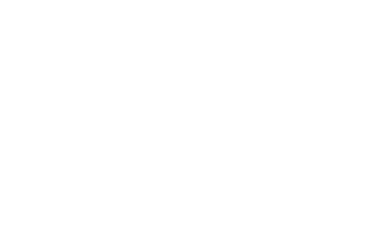 <!-- .element height="70%" width="70%" -->

Note: This diagram shows the recursive call tree. Notice how the same subproblems appear multiple times — for example, aligning prefixes x[1..2] with y[1..2] gets computed from multiple paths. Without memoization, the number of recursive calls is exponential. With memoization (or bottom-up DP), we compute each unique subproblem exactly once. The total number of unique subproblems is m times n (all possible prefix pairs), which is polynomial.

---

## Sequence alignment: optimal substructure
Define $OPT(i,j)$ = min cost of aligning prefix strings $x_1, x_2, \ldots, x_i$ and $y_1, y_2, \ldots, y_j$

* Case1. $OPT(i,j)$ matches $x_i - y_j$
  * match or mismatch for $x_i – y_j$ + $OPT(x_{i-1}, y_{j-1})$

* Case2a. $OPT(i,j)$ leaves $x_i$ unmatched
  * gap for $x_i$ + $OPT(x_{i-1}, y_j)$

* Case 2b. $OPT(i,j)$ leaves $y_j$ unmatches
  * gap for $y_j$ + $OPT(x_i, y_{j-1})$

Note: This slide connects the abstract proof to the concrete recurrence. OPT(i,j) gives us exactly three choices for the last column of the alignment: match/mismatch xi with yj (diagonal move), gap in y (move up), or gap in x (move left). We take the best of the three. This is the heart of the algorithm — every cell in the DP matrix is computed by looking at exactly three neighbors. Make sure students see the correspondence between the three cases here and the three cases in the optimal substructure proof on the previous slide.

---

## So how does this look?
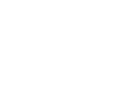

Note: Here we see the DP table laid out as a grid. One sequence labels the rows, the other labels the columns. Each cell (i,j) will hold the optimal alignment score for the first i characters of x against the first j characters of y. 

---

## Exploring the search space
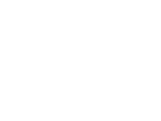

Note: Let's focus on the first i characters from the S1 and first j characters from S2. 

---

## Exploring the search space
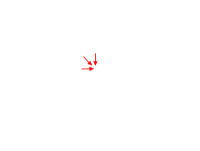

Note: As we fill the matrix, each cell depends only on the cell above, the cell to the left, and the cell diagonally above-left. This means we can fill the matrix row by row (left to right, top to bottom) and all dependencies will already be computed. Ask students: could we fill it column by column instead? Yes — any order that respects the dependencies works.

---

## From theory to algorithm

* Optimal substructure tells us: the solution to a larger alignment **contains** the solution to smaller alignments
* Overlapping subproblems tell us: we solve the **same** sub-alignments many times in a naive recursive approach
* **Key idea**: build a matrix $M$ where $M(i,j)$ = optimal alignment score for $x[1..i]$ vs $y[1..j]$
* Fill $M$ bottom-up so each cell is computed **once**, using previously computed cells
* The final answer is at $M(m,n)$ for global alignment

Note: This is the standard DP recipe — define a table, write a recurrence that relates larger entries to smaller ones, and fill the table in an order that ensures all dependencies are already computed. The matrix M is sometimes called F in textbooks; the key point is that each entry stores the best score achievable for aligning the first i characters of x with the first j characters of y.

---

## Dynamic Programming
* Create a large table indexed by $(i,j)$
* Decide on the recursion formula
* Decide on optimal traversal order
* Compute each sub-alignment once
* Remember the choices 

Note: Use memoization (storing the results of expensive function calls and returning the cached result) for sub-problem if they are reused. If the subproblems are not reused, then maybe DP is not the right choice as an algorithm. Computation order matters, and most times bottom up will work though it is not obvious a lot of the times. Once you have the set up, then start filling the table, find the optimal score. Traceback to find the optimal solution.

---

## Scoring schemes

* To fill matrix $M$, we need concrete scores for each operation:
  * **Match**: $+1$ (characters are identical)
  * **Mismatch**: $-1$ (characters differ — a substitution)
  * **Gap** (insertion or deletion): $-2$
* Why penalize gaps more heavily than mismatches?
  * A mismatch changes one character — a single point mutation
  * A gap shifts the entire reading frame — insertions/deletions are rarer and often more disruptive
* These are simple integer scores; for proteins, we use **substitution matrices** (e.g., BLOSUM62) that assign different scores to each pair of amino acids

Note: The specific values (+1, -1, -2) are for illustration. In practice, scoring parameters are chosen based on the biological context. For closely related DNA sequences, a simple scheme works well. For protein alignments, substitution matrices derived from empirical data (observed mutation frequencies) give much better sensitivity. We will revisit substitution matrices later in the lecture.

---

##  Computing alignment recursively
* Local update rules, only look at neighboring cells
* Computing the score of a cell from smaller neighbors

<div>$$M(i,j) = max \begin{cases} M(i-1,j) - gap \\ M(i-1, j-1) + score \\ M(i, j-1) - gap \end{cases}$$</div>

* Compute scores for prefixes of increasing length$\ \ \ \ \ \ $

Note: This is the formal recurrence. Walk through it carefully: M(i-1,j-1) + score is the diagonal move (match or mismatch — score is positive for match, negative for mismatch). M(i-1,j) - gap is moving down (gap in y, i.e., we consume a character from x but not y). M(i,j-1) - gap is moving right (gap in x). We take the max of the three because we want the highest-scoring alignment. Remind students that "score" here refers to the match/mismatch value from our scoring scheme (or substitution matrix), while "gap" is always a penalty.

---

## Example
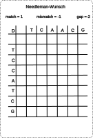 <!-- .element height="40%" width="40%" -->

Note: Start the worked example here. Walk through the first few cells step by step. For each cell, show which of the three neighbors (diagonal, up, left) gives the best score. Ask students to predict the next cell before you reveal it. This active engagement helps them internalize the recurrence.

---

## Example
 <!-- .element height="40%" width="40%" -->

Note: Continue filling the matrix row by row. For each cell, ask: what is the best way to get here? Diagonal (match/mismatch with the scoring scheme), from above (gap in the horizontal sequence), or from the left (gap in the vertical sequence). Record which direction gave the best score — this arrow will be used during traceback.

---

## Example
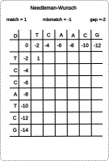 <!-- .element height="40%" width="40%" -->

Note: As more of the matrix fills in, patterns emerge. Cells along the diagonal tend to have higher scores when the sequences are similar. Cells far from the diagonal require many gaps and tend to have lower (or negative) scores. This visual pattern foreshadows the banded alignment optimization — if we know the sequences are highly similar, we can skip cells far from the diagonal.

---

## Example
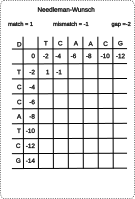 <!-- .element height="40%" width="40%" -->

Note: We are nearly done filling the matrix. Notice how scores propagate — a good match early on (high diagonal score) raises the scores of downstream cells. Conversely, a region of mismatches or gaps pulls scores down. The final score in the bottom-right corner reflects the cumulative best alignment across the entire length of both sequences.

---

## Example
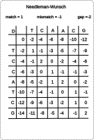 <!-- .element height="40%" width="40%" -->

Note: The matrix is now fully filled. The value in the bottom-right cell is the optimal global alignment score. But the score alone does not tell us the alignment — we need to trace back through the matrix to reconstruct which choices were made at each step. This is the traceback phase, covered in the next slides.

---

## Returning an optimal path
 <!-- .element height="40%" width="40%" -->

Note: Traceback starts at the bottom-right corner (the optimal score) and follows the arrows backward to (0,0). At each cell, we check which neighbor the score came from: diagonal means match/mismatch (align both characters), up means gap in y (consume x only), left means gap in x (consume y only). The path we trace gives us the alignment, read backward.

---

## Returning an optimal path
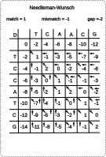 <!-- .element height="40%" width="40%" -->

Note: First traceback step. We look at the bottom-right cell and determine which neighbor it came from. A diagonal arrow means this column of the alignment pairs two characters; a vertical or horizontal arrow means one character is paired with a gap.

---

## Returning an optimal path
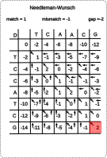 <!-- .element height="40%" width="40%" -->

Note: Each step of the traceback adds one column to our alignment (reading right to left). Ask students to read out what the alignment looks like so far — which characters are paired, and where are the gaps?

---

## Returning an optimal path
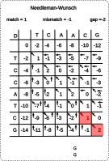 <!-- .element height="40%" width="40%" -->

Note: Notice that the path is not always strictly diagonal. When it moves vertically or horizontally, that indicates a gap in one of the sequences. These gaps correspond to insertions or deletions that occurred during evolution.

---

## Returning an optimal path
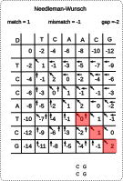 <!-- .element height="40%" width="40%" -->

Note: We are about halfway through the traceback. Each step is O(1) — just look at the stored arrow and move to the corresponding neighbor. The total traceback takes O(m+n) time, which is linear in the alignment length.

---

## Returning an optimal path
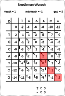 <!-- .element height="40%" width="40%" -->

Note: Continue tracing back. Point out that at some cells, the traceback arrow might not be unique — if two neighbors gave the same score, either direction is valid. This is where alternate optimal alignments branch off (we will see an example shortly).

---

## Returning an optimal path
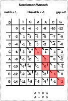 <!-- .element height="40%" width="40%" -->

Note: Getting close to the origin. The path should end at cell (0,0), which represents the empty-vs-empty alignment. If we reach the top row or left column before (0,0), the remaining steps are all gaps.

---

## Returning an optimal path
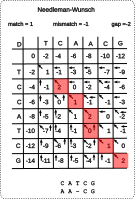 <!-- .element height="40%" width="40%" -->

Note: Almost there. Have students read the full alignment from the path so far. Count the matches, mismatches, and gaps. Verify that the score adds up: sum of match scores minus mismatch and gap penalties should equal the value in the bottom-right cell.

---

## Returning an optimal path
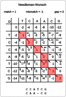 <!-- .element height="40%" width="40%" -->

Note: One more step to go. This is a good moment to ask: what is the time complexity of the traceback? O(m+n) — we visit at most m+n cells on the path from bottom-right to top-left. Combined with the O(mn) matrix-filling phase, the total algorithm is O(mn) time and O(mn) space.

---

## Returning an optimal path
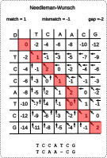 <!-- .element height="40%" width="40%" -->

Note: We have now traced back the complete path from bottom-right to top-left. Reading the alignment from the path: diagonal moves give aligned pairs, vertical moves give gaps in the top sequence, horizontal moves give gaps in the side sequence. This is the final alignment. But is it the only optimal alignment?

---

## Returning an alternate optimal path
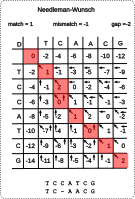 <!-- .element height="40%" width="40%" -->

Note: No — there can be multiple optimal alignments with the same score. Whenever a cell's score could have come from more than one neighbor (a tie), there is a branch point in the traceback. Each branch gives a different alignment with the same optimal score. In practice, tools like BLAST or Clustal may report only one, but the non-uniqueness is important to keep in mind: the "right" alignment is not always well-defined, especially in regions of low similarity.

---

## Needleman-Wunsch complexity

* **Time**: $O(m \times n)$ — fill every cell in the matrix; each cell requires constant work (compare three neighbors)
* **Space**: $O(m \times n)$ — store the entire matrix for traceback
* Concrete example: aligning two 1,000 bp sequences
  * DP: $10^6$ operations — fast
  * Brute force: $\approx 2^{2000}$ alignments — utterly infeasible
* This is the power of dynamic programming: exploring an exponential search space in polynomial time

Note: The quadratic space requirement becomes a bottleneck for very long sequences (e.g., whole chromosomes). We will see how to reduce space to O(min(m,n)) using the Hirschberg algorithm (linear-space DP) while maintaining the same time complexity.

---

## Sequence alignment
* Allow gaps 
  * Insertions and deletions
  * unit cost for each character deleted or inserted
* Varying penalties for edit operations
  * Transitions vs. Transversions
* Affine gap
* Frame-aware gap 

Note: This slide previews the variations we will cover. Key points to emphasize: (1) so far we have used uniform gap penalties, but biology suggests gaps should cost more to open than to extend (affine gaps); (2) transitions and transversions have different biological likelihoods, motivating substitution matrices; (3) frame-aware gaps are important for protein-coding DNA — a gap of length not divisible by 3 shifts the reading frame, which is usually catastrophic. Time and space are both O(mn) for the basic algorithm.

---

## Not all substitutions are equal

* **DNA**: transitions (purine↔purine, pyrimidine↔pyrimidine) are more frequent than transversions (purine↔pyrimidine)
* **Proteins**: conservative substitutions (e.g., leucine↔isoleucine) preserve biochemical properties; radical substitutions (e.g., glycine↔tryptophan) often disrupt function
* Simple match/mismatch scoring ignores this biological reality
* **Substitution matrices** capture empirically observed substitution rates
  * DNA: transition/transversion ratio
  * Protein: BLOSUM, PAM families

Note: Substitution matrices are derived from observed frequencies of amino acid replacements in aligned protein families. BLOSUM62 is computed from blocks of aligned sequences with no more than 62% identity — it is the default for most protein BLAST searches.

---

## Substitution matrices in practice

* A substitution matrix $S$ assigns a score $S(a,b)$ to every pair of residues
* Example entries from BLOSUM62:
  * $S(\text{Leu}, \text{Ile}) = +2$ — similar hydrophobic residues, frequently interchangeable
  * $S(\text{Gly}, \text{Trp}) = -3$ — very different size and chemistry
  * $S(\text{Cys}, \text{Cys}) = +9$ — cysteines are highly conserved (disulfide bonds)
* The recurrence becomes: $M(i,j) = \max\{M(i-1,j-1) + S(x_i, y_j),\ \ldots\}$
* Higher BLOSUM number (e.g., 80) → more closely related sequences; lower (e.g., 45) → more distant

Note: PAM matrices use a different approach — they model point mutations over evolutionary time. PAM1 represents 1% divergence. PAM250 is used for distant homologs. BLOSUM matrices are generally preferred for database searches because they are derived directly from observed alignments rather than extrapolated from a mutation model.

---

## Insight : A gap changes the diagonal
 <!-- .element height="40%" width="40%" -->

Note: Look at the traceback path — every time we take a gap (up or left move), we shift off the main diagonal. A perfect match with no gaps would follow the exact diagonal. This insight is useful for banded alignment: if we expect the two sequences to be highly similar, we only need to compute cells near the diagonal, reducing time from O(mn) to O(kn) where k is the band width. Many practical tools use this optimization.

---

## Linear-space alignment

The following slides cover how to reduce space from $O(mn)$ to $O(\min(m,n))$ using the Hirschberg algorithm. The key takeaway is that it is possible to align long sequences without storing the full matrix.

Note: You can skip these slides if short on time. The key message students should take away: the O(mn) space of basic NW is a real bottleneck (two 100K-base sequences = 10 billion cells = ~40 GB), but clever algorithms reduce this to linear space. If students ask how, these slides explain it.

---

## Linear-time bound DP
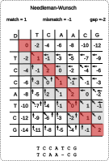 <!-- .element height="40%" width="40%" -->

Note: The key observation: to compute row i, we only need row i-1. So we can discard all earlier rows and use just two rows (or even one row with careful bookkeeping). This gives us the optimal score in O(n) space. But we lose the traceback — we do not know which path through the matrix gave us the optimal score. The next slides show how to recover the traceback.

---

## Linear-space bound DP
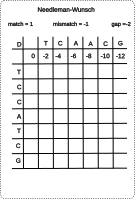 <!-- .element height="40%" width="40%" -->

Note: Here we see the divide step of Hirschberg's algorithm. We run the forward DP from the top and the backward DP from the bottom, both keeping only two rows in memory. Where they meet at the middle row, we find the cell that lies on the optimal path. This gives us one anchor point of the alignment in O(n) space.

---

## Linear-space bound DP
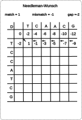 <!-- .element height="40%" width="40%" -->

Note: Now we recurse on the two halves: the top-left subproblem (from start to the midpoint) and the bottom-right subproblem (from the midpoint to the end). Each recursion halves the number of rows. The total work across all recursion levels is still O(mn) because each level processes the full width of the matrix, but the number of rows halves each time (geometric series).

---

## Linear-space bound DP
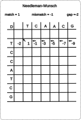 <!-- .element height="40%" width="40%" -->

Note: After enough recursion levels, we have recovered the full traceback path through the matrix — all without ever storing the full matrix. Space usage is O(min(m,n)) at each recursion level, and the recursion depth is O(log(max(m,n))). This is a beautiful algorithm, but in practice many tools use the simpler banded approach instead when sequences are known to be similar.

---

## Linear-space bound DP
* Best score can be computed in linear space
    * use just one column/row
* Traceback?
    * Using a divide and conquer approach
    * A [description with pseudocode](https://www.cs.cmu.edu/~ckingsf/bioinfo-lectures/linspace.pdf) from Carl Kingsford at CMU
    * Manuscript from [Myers and Miller](http://www.cs.ucf.edu/courses/cap5510/fall2009/SeqAlign/Linear_Space_Alignment.pdf)

Note: The Hirschberg trick: run the forward DP on the top half and the backward DP on the bottom half, both in linear space. Where their scores meet at the middle row gives us one point on the optimal path. Then recurse on the two halves. Total time is still O(mn) (the constant roughly doubles), but space is O(min(m,n)). This is a beautiful example of combining DP with divide-and-conquer. The Myers and Miller paper (1988) made this practical for biological sequences.

---

## Local alignments
A local alignment of string $s$ and $t$ is an alignment of a substring of $s$ with a substring of $t$

* Why local alignments?
  * Small domains of a gene may be only conserved portions
  * Looking for a small gene in a large chromosome
  * Large segments often undergo rearrangements

Note: Global alignment forces the entire length of both sequences to participate. This is problematic when only a small region is conserved (e.g., a 50-amino-acid domain shared between two otherwise unrelated 500-amino-acid proteins). Global alignment would penalize all the unrelated flanking regions, masking the real signal. Local alignment finds the best-scoring subsequence pair, ignoring the rest. This is what BLAST does.

---

## Local alignment vs Global alignment
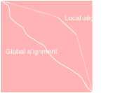 <!-- .element height="50%" width="50%" -->

Note: The visual here is key. In global alignment, the entire sequences are aligned end-to-end, even if the ends are dissimilar (leading to many gap penalties). In local alignment, only the best-matching region is reported. Point out that local alignment is strictly more general — a global alignment is a special case of local alignment where the best local region happens to span both full sequences.

---

## When to use which?

| Scenario | Algorithm | Why |
|----------|-----------|-----|
| Two full-length homologous genes | **Global** (NW) | Sequences are similar end-to-end |
| Conserved domain in a larger protein | **Local** (SW) | Only a region is shared |
| Short read → reference genome | **Semi-global** | Align entire read, allow free end gaps in reference |
| Query against a large database | **Local** (BLAST) | Most of the database is unrelated |

* Rule of thumb: if both sequences should align end-to-end → global; if you expect only partial matches → local

Note: Semi-global alignment is a variant where gaps at the beginning or end of one or both sequences are not penalized. This is useful for overlap detection in genome assembly and for mapping short reads to a reference. The recurrence is the same as NW, but initialization and termination differ.

---

## Global Alignment (Needleman-Wunsch algorithm)
**Initialization:** $F(0,0) = 0, F(i,0) = -gap \times i, F(0, j) = -gap \times j$

**Iteration:**

<div>$$F(i,j) = max \begin{cases} F(i-1,j) - gap \\ F(i-1, j-1) + score \\ F(i, j-1) - gap \end{cases}$$</div>

**Termination:** Bottom right

Note: Needleman-Wunsch (1970) was the first application of DP to sequence alignment. Three key differences from Smith-Waterman to highlight: (1) Initialization penalizes gaps — F(i,0) = -gap*i means aligning i characters of x against nothing costs i gap penalties. (2) The recurrence has no floor at zero — scores can go negative. (3) Termination is always at the bottom-right corner because the entire sequences must participate. This guarantees a global alignment.

---

## Local alignment (Smith-Waterman algorithm)
**Initialization:** $F(i,0) = F(0,j) = 0$

**Iteration:**

<div>$$F(i,j) = max \begin{cases} 0 \\ F(i-1,j) - gap \\ F(i-1, j-1) + score \\ F(i, j-1) - gap \end{cases}$$</div>

**Termination:** Anywhere

Note: Smith-Waterman (1981) makes three elegant changes to NW: (1) Initialization is all zeros — a local alignment can start anywhere, so there is no penalty for skipping the beginning of either sequence. (2) The recurrence includes a zero option — if all three inherited scores are negative, we start fresh. This means we can also skip the end of either sequence. (3) Termination: the optimal local alignment score is the maximum value anywhere in the matrix, not just the bottom-right corner. Traceback starts from that maximum cell and stops when we hit a zero. Despite being "just" three changes to NW, the biological implications are profound — this is what makes database search possible.

---

## More variations 
* Semi-global alignment
  * At least one of the sequences to the end 
* Different gap penalties
  * Affine gap penalties 
  * Length mod 3 penalties for protein coding regions

Recurrence equation with modifications can accomodate these variations

Note: Frame-aware gap penalties are used when aligning protein-coding DNA. A gap whose length is a multiple of 3 preserves the reading frame and only removes/adds whole codons. A gap of length 1 or 2 shifts the reading frame, changing every downstream amino acid — usually catastrophic for the protein. So frame-preserving gaps are penalized much less than frame-shifting ones. This is an example of how biological knowledge directly shapes the scoring scheme.

---

## Affine gap penalties

* Linear gap penalty: each gap position costs $-d$ → total cost of a gap of length $k$ is $-kd$
* Problem: a single 5-base insertion is biologically **one event**, but linear scoring penalizes it like five separate events
* **Affine gap penalty**: $\text{gap cost}(k) = -d - (k-1) \times e$
  * $d$ = gap **open** penalty (high, e.g., $-10$)
  * $e$ = gap **extend** penalty (low, e.g., $-0.5$)
* Requires three matrices instead of one:
  * $M(i,j)$: best score ending in a match/mismatch
  * $I_x(i,j)$: best score ending in a gap in $x$
  * $I_y(i,j)$: best score ending in a gap in $y$

Note: Affine gap penalties better model real biology because insertions and deletions tend to occur as single mutational events affecting multiple consecutive bases. A 10-base deletion is more likely than 10 independent single-base deletions. The three-matrix formulation tracks whether we are currently inside a gap or not, so we know whether to charge the open or extend penalty.

---

## Dynamic Programming

* https://github.com/uvacobi/sequence_alignment
* Implement local alignment of two sequences that can use affine gap penalties
* Skeleton code is provided in python 
* Simple test cases are also provided 
* Clone the repo, implement the `smith_waterman` function in `align_sequences.py`
* You can test your work by running `python3 testdriver`

Note: Give students time to work on this. Common pitfalls: (1) forgetting to initialize the first row and column, (2) confusing gap open vs. gap extend when implementing affine penalties, (3) traceback errors when the optimal path goes through a zero cell in local alignment. Encourage them to test with simple cases first (identical sequences, completely different sequences, sequences that differ by one gap) before running the full test suite.

---

## Why exact matching?

* Sometimes we need to find an **exact** sequence in a larger string — no mismatches, no gaps
* Biological use cases:
  * **Primer design**: find where a PCR primer binds in a genome
  * **Restriction sites**: locate enzyme recognition sequences (e.g., `GAATTC` for EcoRI)
  * **Known motifs**: search for a regulatory element or adapter sequence
* Local alignment ($O(mn)$) is overkill when you know the query matches perfectly
* Can we do this in **linear time**?

Note: This is a good moment to pause and ask: we just spent a lot of time on alignment (O(mn)). When do we NOT need alignment? When we know the query matches exactly — no mutations, no gaps. PCR primers are designed to match perfectly. Restriction enzymes cut at exact recognition sequences. Adapter trimming in sequencing looks for exact adapter sequences. For these problems, alignment is overkill. We want O(n) search through a genome of length n, regardless of pattern length.

---

## Linear time exact matching
* gene in chromosome (local alignment is expensive)
* Karp-Rabin algorithm
  * Insight : if $|\sum|= d$, a string represents a number in base $d$
  * AGCT = 0123

Note: The alphabet size d is 4 for DNA. So a DNA k-mer can be represented as a base-4 number. For example, ACG = 0*16 + 1*4 + 2 = 6. Comparing two numbers is O(1) instead of O(k) for character-by-character comparison. The key insight of Karp-Rabin is that when we slide the window by one position, we can update the number in O(1) using arithmetic — we do not need to recompute from scratch.

---

## Karp-Rabin algorithm
Insight: Interpret string as numbers for fast comparisons
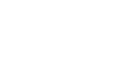

Note: Walk through the example: we have a pattern of length k and a text of length n. We compute the numerical value of the pattern, then slide a window of length k across the text, computing the numerical value at each position. If the numbers match, the strings match. The trick is making the sliding-window update O(1).

---

## Karp-Rabin algorithm
Compute next number based on the previous one 
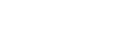

* Shift middle digits of the number to the left
* Remove the higher order bit
* Add the low order bit

Note: This is the rolling hash update. If the old window was characters c1,c2,...,ck and the new window is c2,c3,...,c(k+1), we compute: new_value = (old_value - c1 * d^(k-1)) * d + c(k+1). Subtract the contribution of the outgoing character, shift everything left (multiply by d), add the incoming character. Each step is O(1) arithmetic. For DNA with d=4, this is just bit shifting and addition.

---

## Karp-Rabin algorithm

* Reduce the number of comparisons using hashing
* Mapping keys $k$ from large universe $U$ (of string/numbers) into a smaller space $[1..m]$
* Many hash functions possible with theoretical and practical properties
  * Reproducibility: $x=y \rightarrow h(x) = h(y)$
  * Uniform output distribution: $x \ne y \rightarrow P(h(x) = h(y)) = 1/m$
* Worst case runtime $O(mn)$

Note: Hashing reduces the number comparison from a potentially large number to a smaller one, preventing integer overflow. The trade-off: hash collisions (false positives) require a character-by-character verification. Worst case O(mn) happens if every position produces a hash match (e.g., searching for AAAA in AAAAAA...A). In practice with a good hash function, false positives are rare and average-case performance is O(n+m). This is similar to how hash tables have O(1) average but O(n) worst-case lookup.

---

## Karp-Rabin algorithm

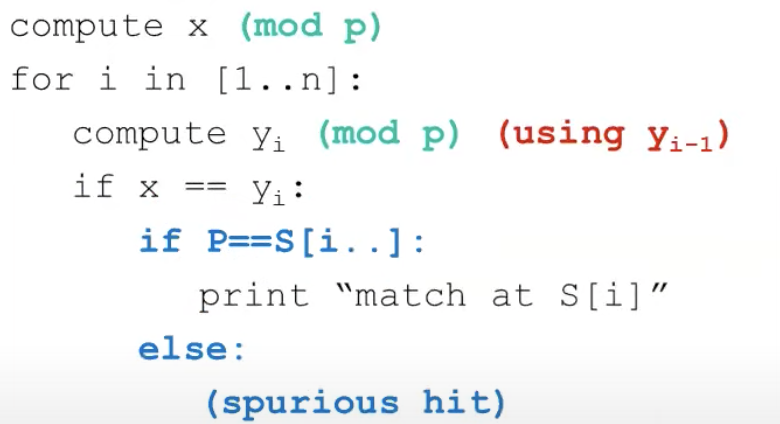 <!-- .element height="50%" width="50%" -->

Note: This summarizes the full Karp-Rabin pipeline. Emphasize the connection to what comes next: BLAST also uses a seed-based approach where short exact matches are found quickly and then extended. Karp-Rabin is the conceptual foundation — find candidate positions fast using numerical/hash tricks, then verify. BLAST extends this idea to handle inexact matches through neighborhood search.

---

## BLAST and inexact matching

* Sequence alignment
  * Sequences have some common ancestry
  * Find optimal alignment between two sequences
  * Evolutionary interpretation: min # events, ...
* Sequence database search
  * Given a query and target sequences: which sequences are related to the query
  * Individual alignments need not be perfect 
  * Most sequences are completely unrelated to query

Note: BLAST stands for Basic Local Alignment Search Tool. This slide frames the shift from pairwise alignment to database search. Pairwise alignment: we have two sequences we believe are related, and we want the best alignment. Database search: we have one query and millions of targets, most of which are unrelated. Running Smith-Waterman against every sequence in a database would be correct but far too slow (e.g., searching against UniProt's 250M+ sequences). BLAST sacrifices guaranteed optimality for massive speed gains through a heuristic seed-and-extend approach.

---

## BLAST

* Exploit the nature of the problem
  * Prescreen sequences for common stretches
  * Preprocess the database if it is offline

* Key insights
  * Semi-numerical string matching like Karp-Rabin
  * Neighborhood search

Note: Two key ideas make BLAST fast: (1) Like Karp-Rabin, use short exact matches as seeds to quickly filter out unrelated sequences — most of the database will not share even a short word with your query. (2) Neighborhood search extends this to inexact matching — instead of looking for exact word matches only, also look for words that score highly against the query word using the substitution matrix. This dramatically increases sensitivity without much cost because the neighborhood is precomputed.

---

## Blast algorithm overview 

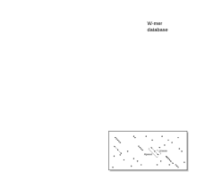 <!-- .element height="70%" width="70%" -->

<small>[The Statistics of Sequence Similarity Scores](https://www.ncbi.nlm.nih.gov/BLAST/tutorial/Altschul-1.html)</small>

Note: * Split query into overlapping words of length W. * Find neighborhood words for each word until threshold T. * Look in table where these neighbor words occur: seeds S. * Extend seeds S until score drops off under X. * Report significance and alignment of each match

---

## BLAST walkthrough example

Query: `MKTLLILAVF` (first 10 aa of a protein), $W=3$

1. **Split** into words: `MKT`, `KTL`, `TLL`, `LLI`, `LIL`, `ILA`, `LAV`, `AVF`
2. **Neighborhood**: for each word, find all 3-mers scoring $\geq T$ using BLOSUM62
   * e.g., `MKT` → `MKT`, `MKS`, `MRT`, ... (similar amino acids)
3. **Seed lookup**: scan database index for exact matches to any neighborhood word
   * `MKT` found at position 42 in sequence `sp|P12345`
4. **Extend** seed in both directions — keep extending while score stays above threshold $X$
5. **Report** alignment with score and E-value

Note: In practice, BLAST preprocesses the database into a lookup table mapping every W-mer to its positions. This makes step 3 very fast — essentially a hash table lookup. The key trade-off is between sensitivity and speed: smaller W finds more distant homologs but is slower; larger W is faster but misses weak matches. Default W=3 for protein, W=11 for DNA.

---

## Statistical significance of alignments

* High-scoring alignments can occur **by chance** — longer sequences and larger databases increase the odds
* **E-value** (Expect value): the expected number of alignments with score $\geq S$ that would occur by chance in a database of this size
* Rule of thumb:
  * $E < 0.001$: statistically significant
  * $E \approx 1$: expected to see one match by chance
  * $E > 10$: likely not biologically meaningful
* Larger database $\rightarrow$ higher E-value for the same alignment score

Note: The E-value depends on both the score and the size of the search space (database). A perfect match to a short query may still have a high E-value if the database is very large. Always consider E-values rather than raw scores when interpreting BLAST results.

---

## Why does BLAST work?

* Pigeonhole principle
  *  if $n$ items are put into $m$ containers, with $n>m$, then at least one container must contain more than one item
* Applying to alignments
  * Two sequences, each 9 amino-acids, with 7 identities
  * 3 amino-acids perfectly conserved

Note: The pigeonhole principle guarantees that if two sequences share enough identities, at least one short word must match exactly. Work through the example: 9 amino acids with 7 identities means only 2 mismatches. If we use W=3, we have 7 overlapping 3-mers. Even if the 2 mismatches are placed to disrupt as many 3-mers as possible, at most 2*2=4 can be affected (each mismatch ruins at most 2 neighboring windows). So at least 3 words must match perfectly. This is why BLAST's seed strategy works — it is guaranteed to find a seed for sufficiently similar sequences.

---

## Extensions to the basic algorithm
* Filtering : Low complexity regions 
* Two hit BLAST
  * Two smaller W-mers more likely than a long one
* Non-consecutive k-mers
  * No reason to use only consecutive symbols
  * RGIKW $\rightarrow$ R\*IK\*, RG\*\*W, $\ldots$
  * How to choose positions for *:
    * Random
    * Learn from data

Note: Low-complexity filtering (e.g., SEG for proteins, DUST for DNA) masks regions like poly-A tails or proline-rich regions that would produce spurious matches everywhere. Two-hit BLAST requires two nearby seed matches before triggering extension — this dramatically reduces the number of extensions (the most expensive step) with minimal sensitivity loss. Spaced seeds (non-consecutive k-mers) are a more recent innovation where the pattern of required vs. wildcard positions is optimized to maximize sensitivity for a given number of seed hits.

---

## Aligning two strings
 <!-- .element height="40%" width="40%" -->

Note: Bring it full circle — this is the DP matrix we built earlier. Pairwise alignment gives us the optimal alignment between two specific sequences. It is exact (guaranteed optimal given the scoring scheme) but O(mn) per pair.

---

## Querying a database
 <!-- .element height="70%" width="70%" -->

Note: And this is the BLAST pipeline. The contrast: BLAST is a heuristic — it may miss some true homologs (false negatives) but is orders of magnitude faster. For a typical BLAST search against nr (non-redundant protein database, ~250M sequences), results come back in seconds. Running Smith-Waterman against the same database would take hours or days. The take-home message: we need both exact algorithms (NW, SW) and heuristics (BLAST) — exact for careful pairwise analysis, heuristic for discovery at scale.

---

## Glossary: biology terms for CS students

| Term | Definition |
|------|-----------|
| **Ortholog** | Genes in different species derived from a common ancestor by speciation |
| **Paralog** | Genes within a species derived from a duplication event |
| **Reading frame** | One of three ways to divide a DNA sequence into codons (triplets); a frameshift changes the protein entirely |
| **Transition** | Purine↔purine (A↔G) or pyrimidine↔pyrimidine (C↔T) substitution |
| **Transversion** | Purine↔pyrimidine substitution (e.g., A↔C) |
| **Indel** | An insertion or deletion mutation |
| **Conserved** | Unchanged (or nearly so) across species, implying functional importance |

---

## Glossary: CS terms for biology students

| Term | Definition |
|------|-----------|
| **Dynamic programming** | Solving a problem by breaking it into overlapping subproblems and storing results to avoid redundant computation |
| **Memoization** | Caching the result of a function call so repeated calls with the same input return instantly |
| **Recurrence** | A formula that defines each entry of a table in terms of previously computed entries |
| **Traceback** | Following stored pointers backward through the DP table to reconstruct the optimal solution |
| **Hashing** | Mapping data to a fixed-size value for fast lookup; used in Karp-Rabin and BLAST |
| **Big-O notation** | Describes how an algorithm's runtime or memory scales with input size (e.g., $O(n^2)$) |
| **Greedy algorithm** | Makes the locally optimal choice at each step; fast but not always globally optimal |

---
